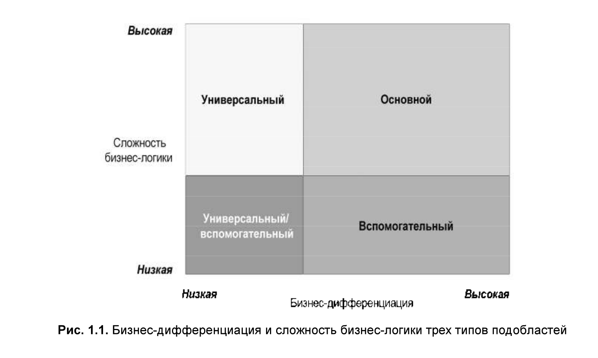
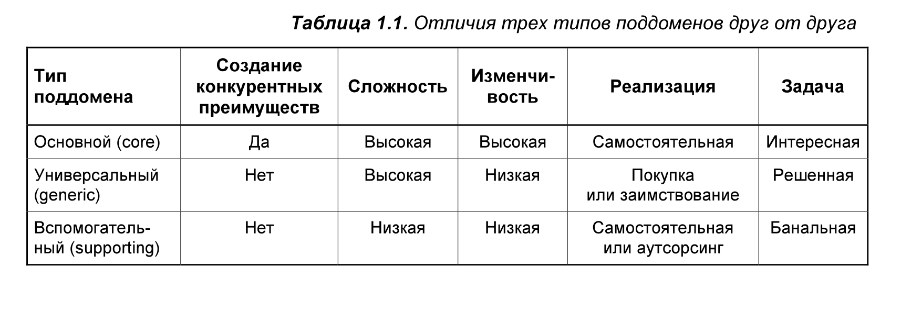
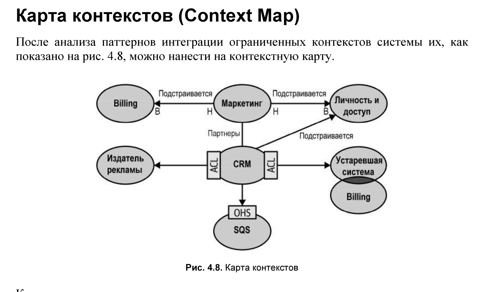

## Глава 1 Анализ предметной области

Поддомен — это четко определенная область деловой активности.
Из всех поддоменов образуется предметная область компании: те самые услуги, которые она предоставляет своим клиентам.

Основной поддомен, который довольно легко реализовать,
может обеспечить лишь кратковременное конкурентное преимущество.
Следовательно, основным поддоменам присуща сложность.

Основные поддомены, как уже выяснилось, могут часто меняться. Если проблему
можно решить с первой попытки, то это, наверное, не будет считаться серьезным
конкурентным преимуществом.

Основные поддомены должны реализовываться в самой компании.
Их нельзя приобрести или позаимствовать, поскольку это подорвало бы само понятие конкурентного преимущества,
т. к. конкуренты компании могли бы сделать то же самое.

Также было бы неразумно отдавать реализацию основного поддомена на аутсорсинг.
Это стратегическая инвестиция. Экономия на основном поддомене рискованна не только в краткосрочной перспективе,
но может иметь фатальные последствия и в будущем: можно, к примеру, утратить поддержку разработанного сторонней
организацией программного кода, а вместе с этим и поддержку целей и задач компании.
Для работы над основными поддоменами компании нужно назначать наиболее квалифицированные кадры.
Кроме того, внедрение основных поддоменов с привлечением собственных сил
позволяет компании оперативно вносить изменения
и развивать решение, а значит, быстрее добиваться конкурентного преимущества.

То есть основные поддомены требуют реализации самых передовых методов проектирования.

Так как универсальные поддомены относятся к разряду сложных, но уже решенных
задач, выгоднее купить готовый продукт или взять на вооружение решение с открытым исходным кодом,
чем тратить время и ресурсы на реализацию универсального поддомена собственными силами.

Поддомен является инструментом, облегчающим процесс принятия решений по проектированию программных средств.
Вероятно, у всех организаций есть множество бизнес-функций, обеспечивающих их конкурентное преимущество, но не
имеющих ничего общего с программным обеспечением.

- **Основные поддомены (core subdomain)**
  Интересные задачи. Деятельность, выполняемая компанией не так, как ее конкурентами,
  благодаря которой она получает свое конкурентное преимущество.
- **Универсальные поддомены (Generic subdomains)**
  Решенные задачи. Это то, что все компании делают одинаково. Здесь нет места
  инновациям и нет в них никакой необходимости. Вместо создания собственных
  реализаций более рентабельно будет воспользоваться существующими решениями.
- **Вспомогательные поддомены (Supporting subdomains)**
  Задачи с очевидными решениями. Это действия, которые компания, скорее всего,
  должна будет осуществлять собственными силами, но они не дают никаких
  конкурентных преимуществ.

## Глава 2 Экспертные знания о предметной области

Как говорит Альберто Брандолини (Alberto Brandolini), разработка программного
обеспечения — это процесс обучения, а рабочий код является побочным эффектом.
Успех программного проекта зависит от эффективности обмена знаниями между
экспертами в предметной области и разработчиками программного обеспечения.
Чтобы решить задачу, нужно понять ее суть.

Исследование причин неудачных разработок программных проектов показало, что
для успешных проектов необходимо продуктивное общение с целью обмена знаниями.

Предметно-ориентированное программирование предлагает более эффективный
способ передачи знаний от экспертов предметной области к программистам:
использование единого языка (ubiquitous language).

Если между экспертами предметной области и программистами есть посредники в виде аналитиков, то информация пройдет
сквозь "испорченный телефон".

### Модель предметной области

Модель — это упрощенное представление вещи или явления, в котором намеренно подчеркиваются одни
аспекты и игнорируются другие. Это абстракция с учетом конкретного использования.

Статистик Джордж Бокс (George Box), «все модели неверны, но некоторые полезны».

По сути, модель является абстракцией.
Понятие абстракции позволяет нам справляться со сложностью, опуская ненужные детали и оставляя под рукой только то,
что необходимо для решения задачи.
С другой стороны, в неэффективной абстракции порой нет необходимого или оставлено ненужное, создающее вредные помехи.
Как было отмечено Эдсгером В. Дейкстрой (Edsger W. Dijkstra) в статье «The Humble Programmer»,
цель абстрагирования не в задании неопределенности, а в создании нового семантического уровня,
на котором можно быть абсолютно точным.

### Глава 4 Интеграция ограниченных контекстов

Ограниченный контекст (Bounded Context) защищает согласованность единого
языка (Ubiquitous Language) внутри своих границ и открывает возможности к построению моделей.
Построить модель, не определив цель ее существования, т. е. не
зафиксировав ее границы, невозможно. Эта граница — граница ответственностей
языков, она означает, что одни и те же бизнес-сущности в разных ограниченных
контекстах могут использоваться для решения различных задач.

Паттерны будут разделены на три группы, каждая из которых представляет собой тип командного
взаимодействия: сотрудничество (cooperation), потребитель-поставщик (customer-
supplier) и разные пути (separate ways).

**Партнерство (Partnership)**
В партнерской (partnership) модели интеграция ограниченных контекстов коорди-
нируется по ситуации. Одна команда может уведомить вторую команду об измене-
нии API, а вторая команда адаптируется к нему в духе сотрудничества — без драм
и конфликтов (см. рис. 4.1).

Общее ядро (shared kernel)
Несмотря на то что границы модели определяются ограниченными контекстами,
бывают случаи, когда одна и та же модель поддомена (subdomain) или часть этой
модели будет реализована сразу в нескольких ограниченных контекстах. Здесь
крайне важно отметить, что общая модель разрабатывается в соответствии с по-
требностями всех ограниченных контекстов. Более того, общая модель должна
быть согласована во всех использующих ее ограниченных контекстах.

Общее ядро (shared kernel) реализуется так, что любая модификация его исходного
кода тут же отражается во всех использующих его ограниченных контекстах.
Если в организации практикуется подход с использованием монорепозитория, об-
щее ядро может быть в виде одних и тех же исходных файлов, на которые ссыла-
ются сразу несколько ограниченных контекстов. Если использование общего моно-
репозитория невозможно, общее ядро можно выделить в отдельный проект и ссы-
латься на него в ограниченных контекстах как на связанную библиотеку. В любом
случае каждое изменение в общем ядре должно инициировать запуск интеграцион-
ных тестов для всех затронутых им ограниченных контекстов.

применять только в том случае, когда затраты на дублирования выше затрат на
координацию
использование общего ядра должно быть строго обосновано.

**Потребитель-Поставщик (Customer-supplier)**
интеграционный контракт может диктовать либо вышестоящая, либо нижестоящая команда.

**Конформист (Conformist)**  

**Предохранительный слой (Anticorruption layer)**  
(потребитель) не желает принимать модель поставщика.

**Сервис с открытым протоколом (Open-Host Service)**  
В каком-то смысле паттерн сервиса с открытым протоколом представляет собой
перевернутый вариант паттерна предохранительного уровня: здесь трансляцией
своей внутренней модели занимается не потребитель, а поставщик.

Можно двигаться к версионированию.

**Разные пути (Separate Ways)**
Дублирование конкретной функциональности обходится дешевле, чем сотруд-
ничество и интеграция.

