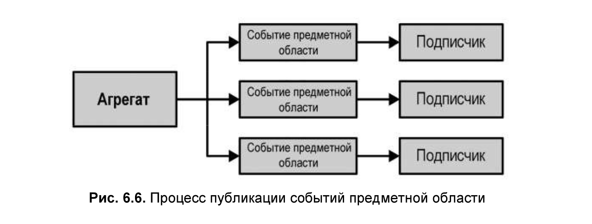
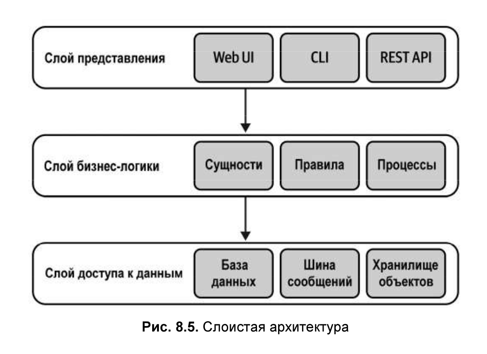
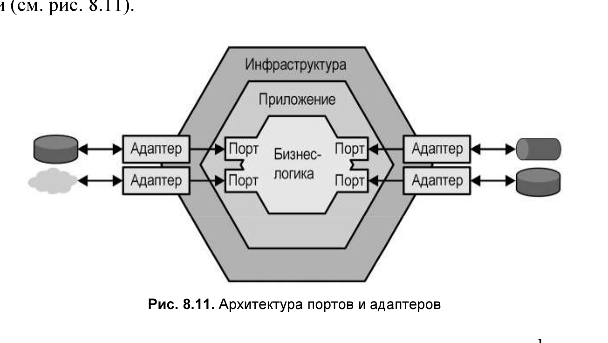
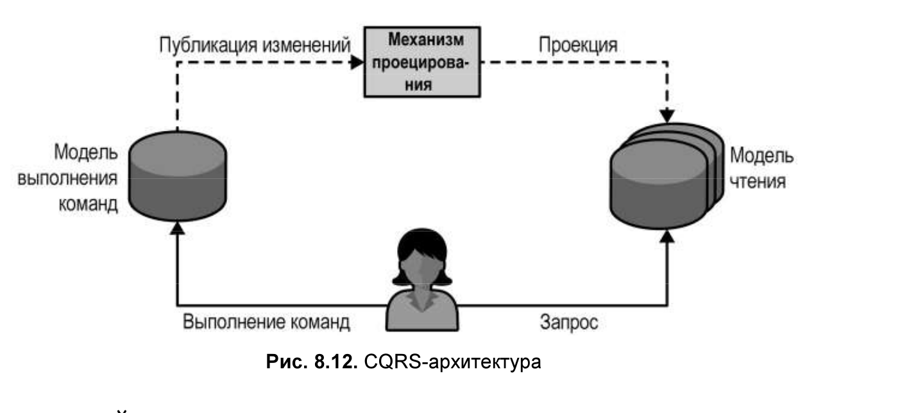
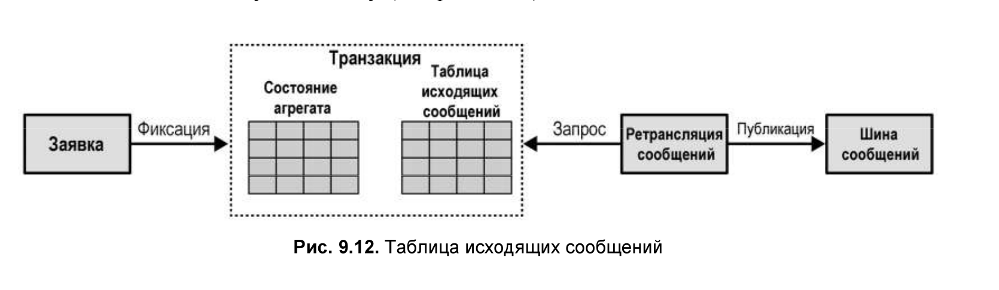
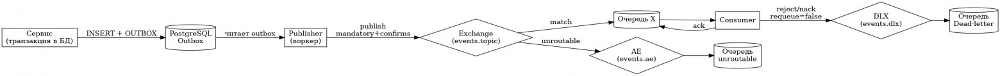
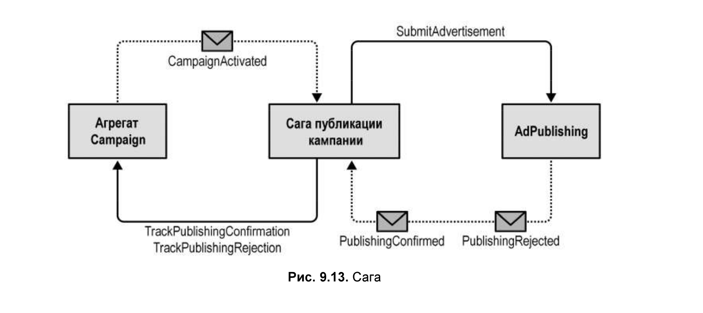
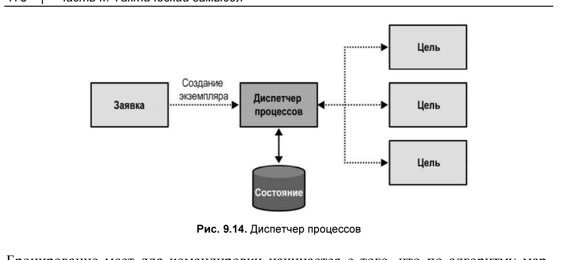

# Тактический замысел

### Реализация простой бизнес-логики

## Проработка сложной бизнес-логики

### Модель предметной области (доменная модель)

Здесь вместо работы с CRUD-операциями решаются вопросы сложных переходов
между состояниями, бизнес-правилами и инвариантами, т. е. незыблемыми правилами.

Модель предметной области — это объектная модель, включающая в себя как поведение, так и данные.
Строительными блоками такой объектной модели являются тактические паттерны DDD —
агрегаты (aggregates), объекты-значения (value objects), события предметной области (domain events) и доменные сервисы (
domain services).

Модель должна быть лишена каких-либо инфраструктурных или технологических проблем,
таких как реализация обращений к базам данных или другим внешним компонентам системы. Это ограничение требует,
чтобы объекты модели были простыми обычными объектами, реализующими бизнес-логику,
не опирающимися на какие-либо инфраструктурные компоненты или
платформы и не включающими их напрямую.

#### Объект-значение

Когда следует использовать объекты-значения. Ответ прост: при любой возможности.
Объекты-значения не только делают код более выразительным и инкапсулируют бизнес-логику, имеющую свойство дублироваться
в разных местах, но и
само применение данного паттерна проектирования делает код более безопасным.
Поскольку объекты-значения неизменяемы, их поведение не имеет побочных эффектов и является потокобезопасным.
С позиции бизнес-области полезным практическим правилом является использование
объектов-значений для элементов предметной области, описывающих свойства других объектов.

#### Сущности

Cущности реализуются не сами по себе, а только в контексте паттерна агрегата

#### Агрегаты

Агрегат — это тоже сущность: для него требуется явное поле идентификации,
и ожидается, что его состояние в течение жизненного цикла экземпляра будет изменяться.
Целью этого паттерна является защита согласованности его данных. Поскольку данные агрегата
могут изменяться, существуют последствия и проблемы, которые паттерн должен
решать для сохранения согласованности своего состояния.

С точки зрения реализации согласованность обеспечивается тем, что изменять
состояние агрегата может исключительно его собственная бизнес-логика.
Всем внешним по отношению к агрегату процессам или объектам разрешено только лишь
чтение состояния агрегата. Его состояние можно изменить, только лишь выполнив
соответствующие методы открытого интерфейса агрегата.

Плюс обработки логики в агрегате, это то что есть только одно место обработки логики.
Код не расползется по методам.

Крайне важно защитить согласованность состояния агрегата.
По сути, операции уровня приложения реализуют паттерн транзакционного сценария.
Т.е. выглядит как будто доменный слой бросает исключения, а уровень приложения их отлавливает.

Следовательно, база данных, используемая для хранения агрегатов, должна поддерживать управление конкурентным доступом.
В своей простейшей форме агрегат должен содержать поле версии, значение которого будет расти после каждого обновления:

- за одну транзакцию базы данных должен изменяться только один агрегат
- Необходимость фиксации изменений сразу в нескольких агрегатах
  сигнализирует о неправильно выбранных границах транзакции и, следовательно,
  о неправильных границах агрегата.

Непротиворечивость данных может быть удобным руководящим принципом для
проектирования границ агрегата. В состав агрегата должна входить только та информация,
которая требуется по бизнес-логике агрегата для строгой согласованности данных.
Вся информация, которая может быть согласована по прошествии
некоторого времени (согласованность в конечном счете, eventual consistency), должна
находиться за пределами агрегата.



#### Доменные сервисы (domain service)

Со временем можно столкнуться с бизнес-логикой, которая либо не принадлежит
ни одному агрегату или объекту-значению, либо представляется имеющей отношение
сразу к нескольким агрегатам. В таких случаях предметно-ориентированное
проектирование предлагает реализовать логику в виде доменного сервиса.

- Доменный сервис — это объект без состояния, в котором реализуется бизнес-логика.
  В подавляющем большинстве случаев такая логика является организатором
  обращений к различным компонентам системы для выполнения каких-либо вычислений или проведения анализа.
- Доменные сервисы упрощают координацию работы сразу нескольких агрегатов

Сложность системы по Голдрату сводится к

- оценке сложности контроля поведения системы
- и предсказанию этого поведения

Инварианты, введенные в ClassB, уменьшают его сложность.
Именно это и делают паттерны агрегатов и объектов-значений: инкапсулируют
инварианты, уменьшая таким образом сложность

Возвращаясь к первоначальному вопросу: поведение какого из классов сложнее
поддается контролю и предсказанию?

Чем меньше в классе переменных, тем легче его контролировать.
Если какие-то переменные можно вывести из других, то лучше так и делать.
Инварианты

# Глава 7. Моделирование фактора времени

# ГЛАВА 8. Архитектурные паттерны

Благодаря применению архитектурных паттернов вводятся организационные принципы для различных аспектов кодовой базы

## Слоистая архитектура (Layered Architecture)

В своей классической форме слоистая архитектура состоит из трех слоев:

- слоя представления (presentation layer — PL),
- слоя бизнес-логики (business logic layer — BLL)
- и слоя доступа к данным (data access layer — DAL).

Хорошо подходит для систем, бизнес-логика которых реализована с использованием
транзакционного сценария или паттерна активной записи.

#### Слой представления (Presentation layer)

- Графический интерфейс пользователя (GUI).
- Интерфейс командной строки (CLI).
- Интерфейс для интеграции с другими системами (API).
- Подписка на события в брокере сообщений.
- Топики сообщений для публикации исходящих событий.

Все это относится к средствам для получения системой запросов из внешней среды
и передачи результатов. Строго говоря, слой представления — это публичный интерфейс программы.

#### Слой бизнес-логики (Business logic layer)

Здесь реализуются бизнес-решения.

#### Слой доступа к данным (Data access layer)

- Базы данных
- интеграцию с различными внешними поставщиками информации
- Облачное хранилище. Шина данных для внутренних нужд системы.

#### Связь между слоями



#### Сервисный слой (Service layer)

Сервисный слой действует как посредник между имеющимися у программы слоями
представления и бизнес-логики.

логику оркестрации -> сервисный слой
Сервисный слой выступает в качестве фасада слоя бизнес-логики: инкапсулируя
вызовы нижележащих слоев.

Наличие явного сервисного слоя дает целый ряд преимуществ:

- Один и тот же сервисный слой может повторно использоваться сразу несколькими публичными интерфейсами,
  например графическим пользовательским интерфейсом и API. Дублирование логики оркестрации не требуется.
- Повышается модульность кода, все связанные методы собираются в одном месте.

Но стоит все же отметить, что необходимость в сервисном слое возникает не все-
гда. Например, когда бизнес-логика реализована в виде транзакционного сценария,
то она, по сути, и представляет собой сервисный слой, поскольку уже предоставля-
ет набор методов, формирующих публичный интерфейс системы. В таком случае
API сервисного слоя будет просто повторять публичные интерфейсы транзакционных
сценариев без абстрагирования и инкапсуляции какой-либо сложности.

- Слой представления = слой пользовательского интерфейса.
- Сервисный слой = прикладной слой.
- Слой бизнес-логики = слой предметной области = слой модели.
- Слой доступа к данным = слой инфраструктуры.

## Порты и адаптеры (Ports and adapters)

Отделение бизнес-логики от всех технологических вопросов делает архитектуру
портов и адаптеров идеально подходящей для бизнес-логики, реализованной с помощью паттерна модели предметной области.



## Command-Query Responsibility Segregation



# ГЛАВА 9. Паттерны взаимодействия

### Паттерн исходящих сообщений (Outbox)

- Состояния обновленного агрегата и новые события предметной области фиксируются в одной и той же атомарной транзакции.
- Ретранслятор сообщений извлекает только что зафиксированные события предметной области из базы данных.
- Ретранслятор публикует события предметной области на шине сообщений.
- При успешной публикации ретранслятор либо помечает события как опубликованные в базе данных, либо полностью их
  удаляет.

Вариант таблицы outbox где будут храниться события:

```sql
CREATE TABLE outbox
(
    event_id    uuid PRIMARY KEY,
    event_type  text        NOT NULL,
    payload     jsonb       NOT NULL,
    status      text        NOT NULL CHECK (status IN ('NEW', 'SENT', 'ERROR')),
    occurred_at timestamptz NOT NULL default now(),
    sent_at     timestamptz
);
```

```sql
create table outbox
(
    id            uuid primary key,
    aggregate     text        not null,
    event_type    text        not null,
    payload       jsonb       not null,
    status        text        not null default 'NEW', -- NEW|SENT|FAILED
    attempts      int         not null default 0,
    next_retry_at timestamptz,
    created_at    timestamptz not null default now()
);

create index on outbox (status, next_retry_at);
```





В RabbitMQ это собирается из четырёх кирпичей:

- Transactional Outbox (события в своей БД до брокера)
- Безопасная публикация (publisher confirms + mandatory / AE)
- Безопасное потребление (ручные ack / nack, DLX, идемпотентность)
- Контроль нагрузки (prefetch, TTL, max-length, приоритеты / разделение очередей)

https://habr.com/ru/articles/943022/

### Сага

Под сагой понимается длительный бизнес-процесс.
Применима когда нужна согласованность состояния между двумя агрегатами.
Нельзя обернуть два агрегата в одну транзакцию.



- Сага отслеживает событие CampaignActivated.
- Запускает команду SubmitAdvertisement
- отслеживает события PublishingConfirmed и
  PublishingRejected из ограниченного контекста AdPublishing
- Запускает одну из команд TrackPublishingConfirmation или TrackPublishingRejection для агрегата Campaign.

Согласованность
Несмотря на то что сага управляет транзакцией, которая включает изменение
нескольких компонентов, состояние изменяемых компонентов в конечном счете
подчиняется принципу согласованности (син. итоговая согласованность, eventual
consistency). И хотя сага в конечном итоге выполнит соответствующие команды,
никакие две транзакции нельзя считать атомарными. Это соотносится с еще одним
принципом построения агрегатов:
Строго согласованными можно считать только данные в пределах границ агрегата.
А все, что вне этих границ, может считаться согласованным только в конечном счете.

Воспользуйтесь этим обстоятельством в качестве руководящего принципа, чтобы
убедиться в отсутствии злоупотребления сагами с целью компенсации неверно
выбранных границ агрегатов. Бизнес-операции, которые должны принадлежать
одному агрегату, требуют строго согласованных данных.

### Диспетчер процессов

- Сага управляет простым линейным потоком действий.
- Строго говоря, сага сопоставляет события соответствующим командам.

Как правило, если сага для выбора правильного курса действий содержит инструкции if-else,
то это, скорее всего, диспетчер процессов.

Еще одно отличие диспетчера процессов от саги заключается в том, что экземпляр
саги создается неявно при отслеживании определенного события, как в
CampaignActivated в предыдущих примерах. А вот диспетчер процессов не может
быть привязан к одному исходному событию. Наоборот, это последовательный
бизнес-процесс, состоящий из нескольких шагов. Следовательно, диспетчер процессов должен быть создан явным образом.




