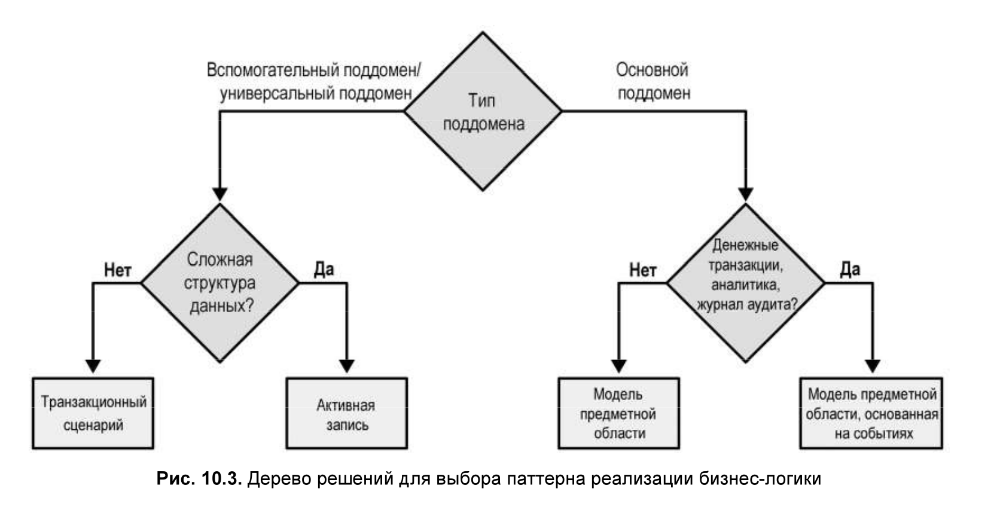
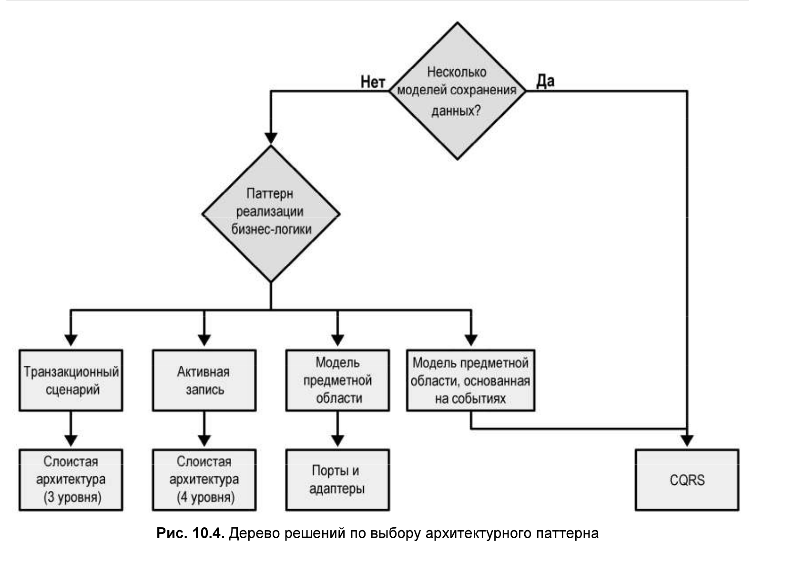
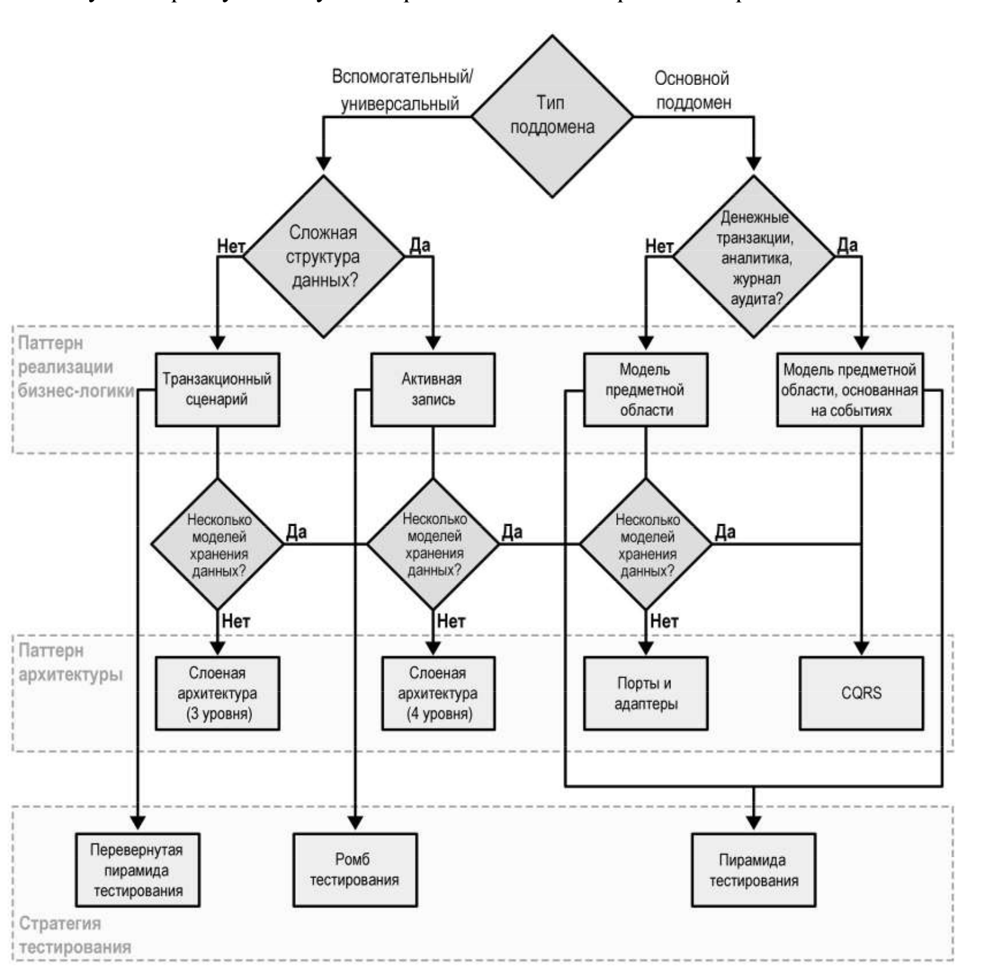
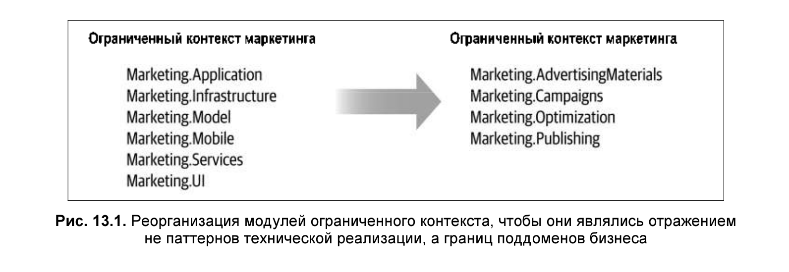
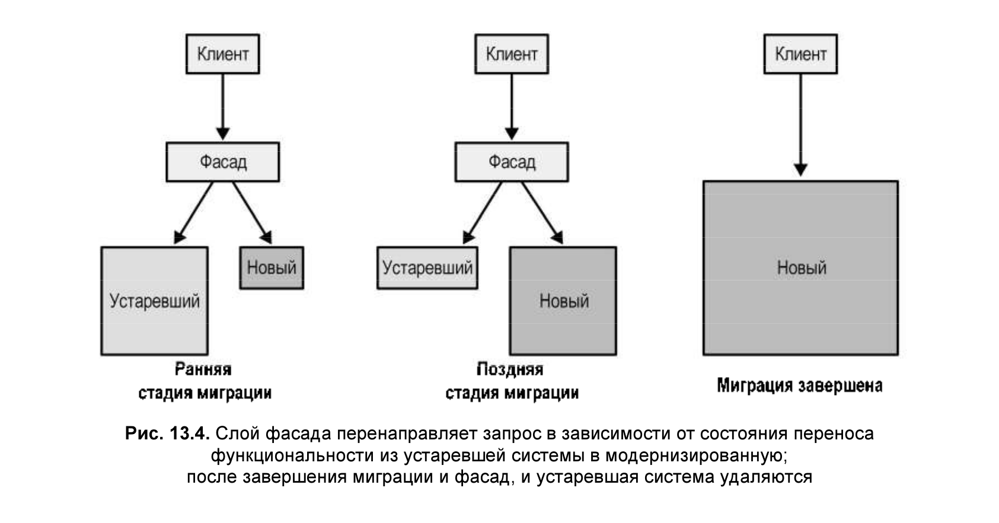

# Применение предметно-ориентированного проектирования на практике

### Ограниченные контексты

### Паттерны реализации бизнес логики

### Архитектурные паттерны

### Стратегия тестирования

## Эволюция проектных решений

#### Преобразование активной записи в модель предметной области

1. Начните с определения объектов-значений (Value Objects).
   Ответьте на вопрос: какие структуры данных можно смоделировать как неизменяемые объекты?
   Найдите соответствующую бизнес-логику и сделайте ее частью объектов-значений.

2 Затем проанализируйте структуры данных и найдите границы транзакций.
Чтобы убедиться, что вся логика изменения состояния является явной,
сделайте все функции задания значений активных записей закрытыми,
чтобы значения можно было изменять только изнутри самой активной записи.

3 проверьте, какие иерархии необходимы для обеспечения
строго согласованной проверки бизнес-правил и инвариантов. Они являются хорошими кандидатами на агрегаты.

- Ищите наименьшие границы транзакций, т. е. наименьшее количество данных, необходимое для обеспечения строгой
  согласованности.
- Разложите иерархии вдоль этих границ.
- Убедитесь, что ссылки на внешние агрегаты идут только по их идентификаторам.
- определите для каждого агрегата его корень или точку входа для его
  публичного интерфейса.
- Сделайте методы всех других внутренних объектов в агрегате закрытыми и вызываемыми только из агрегата.

## Предметно ориентированное программирование на практике.

Знания о бизнес области могут быть утраченны.
Столкновшись с этим обстоятельством, следует предпринять попытку восстановления утраченных
знаний путем проведения EventStorming. Кроме того, системой EventStorming нужно
воспользоваться в качестве основы для развития единого языка.
Нужно принять стратегическое решенений куда следует прилоджить усилия по модернизации.

### Стратегическая модернизация

Предохранительный слой (anticorruption layer)
Предохранительные слои могут оказаться полезными для защиты орграниченных контекстов
от устаревших систем, особенно если в последних используются неэффективные модели с тенденцией
распростронения на нижестоящие компоненты.
Так же можно использовать при частых изменения вышестоящего контекста/сервиса.

#### Паттерн «Душитель» (Strangler)

#### Прагматичное предметно-ориентированное проектирование

Смысл заключается в том, чтобы позволить предметной области вашего бизнеса
управлять решениями по проектированию программного обеспечения.

Всегда начинать с анализа предметной области.
