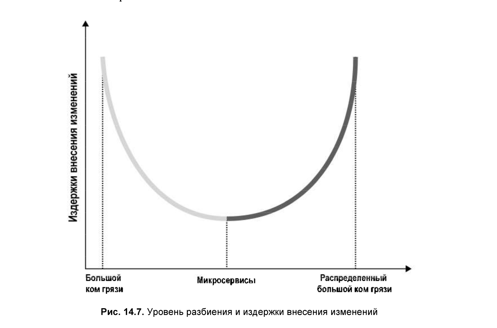

# Взаимоотношения с другими методологиями и паттернами

## Микросервисы

Что такое сервис?
Согласно OASIS сервис - это механизм, обеспечивающий доступ к одной или нескольким
бизнес-компетенциям, предоставляемым с использованием предписаного интерфейса (prescribed interface).

Публичный интерфейс сервиса определяет саму его суть (функциональные возможности).

Что такое микросервис?
Сервис с публичным микроинтерфейсом (входной микродверью).
Наличие публичного микроинтерфейса упрощает понимание как функции отдельного сервиса так и его 
интеграции с другими компонентами системы.
Это объясняет почему в микросервисах никто, кроме самого миросервиса, не может получить прфмой доступ к его 
базе данных. Открытый доступ к базе данных, превращенее ее в парадную дверь сервиса, сделало бы
ее публичный интерфейс просто огромным.
Следовательно микросервисы инкапсулируют свои базы данных.

### Метод как Сервис (Method as a Service)

Крайность.
Сервис стал проще, но взаимодействие между сервисами и система в целом стало сложнее. 
Дж Майерс
Вопрос снижения сложности гораздо шире простой попытки минимизации локальной сложности
каждой части программы. Куда более важным типом сложности является глобальная сложность, под
которой понимается сложность общей структуры программы или системы.

### Микросервисы как глубокие сервисы (deep services)

