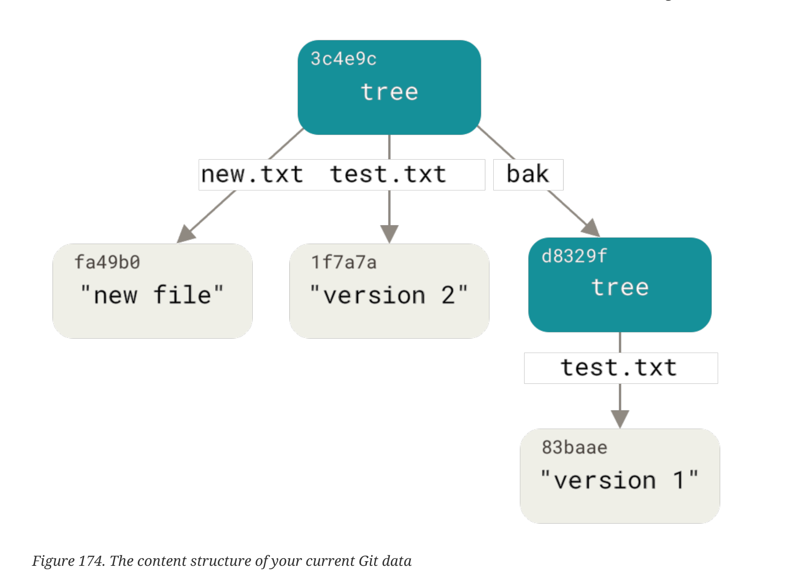
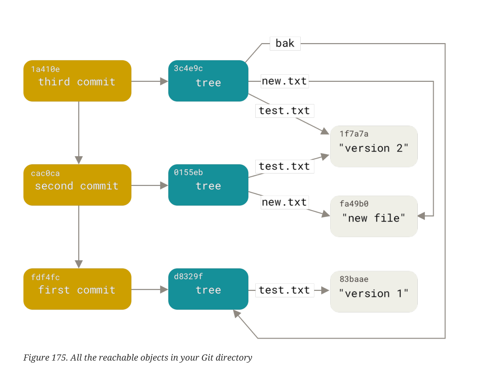
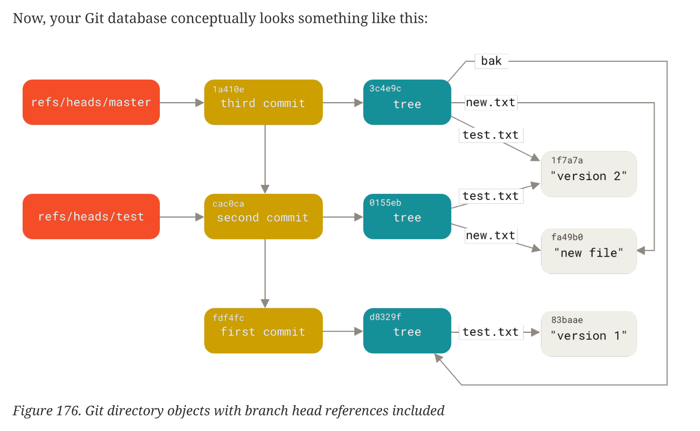

### Intro

Git is fundamentally a content-addressable filesystem with a VCS user interface written on top of it.

- The objects directory stores all the content for your database;
- The refs directory stores pointers into commit objects in that data (branches, tags, remotes and more);
- The HEAD file points to the branch you currently have checked out;
- The index file is where Git stores your staging area information;

### Git Objects

.git/objects

#### blob

Git is a content-addressable filesystem.
It means that at the core of Git is a simple key-value data store.

What this means is that you can insert any kind of content into a
Git repository, for which Git will hand you back a unique key you can use later to retrieve that content.

All files a blob.  
In its simplest form, git hash-object would take the content you handed to it and merely return the
unique key that would be used to store it in your Git database. The -w option then tells the command
to not simply return the key, but to write that object to the database.

```
$ echo 'version 2' > test.txt
$ git hash-object -w test.txt
1f7a7a472abf3dd9643fd615f6da379c4acb3e3a
```

#### tree

Git stores content in a manner
similar to a UNIX filesystem, but a bit simplified. All the content is stored as tree and blob objects,
with trees corresponding to UNIX directory entries and blobs corresponding more or less to inodes
or file contents.

A single tree object contains one or more entries, each of which is the SHA-1 hash
of a blob or subtree with its associated mode, type, and filename.

```git cat-file -p master^{tree}```

Git normally creates a tree by taking the state of your
staging area or index and writing a series of tree objects from it.



#### Commit Objects

Look for git object (blob, tree or commit)
```git cat-file -p fdf4fc3```

The format for a commit object is simple: it specifies the top-level tree for the snapshot of the
project at that point; the parent commits if any

**git add and git commit commands**
— it stores blobs for the files that have changed, updates the index, writes out trees, and
writes commit objects that reference the top-level trees and the commits that came immediately
before them. These three main Git objects — the blob, the tree, and the commit — are initially stored
as separate files in your .git/objects directory.



### Object Storage

How blob is created.

- make hash sha1 from header ("blob #{content.bytesize}\0") and file content.
- Git compresses the new content with zlib
- Keep object like ```path = '.git/objects/' + sha1[0,2] + '/' + sha1[2,38]```

All Git objects are stored the same way, just with different types – instead of the string blob, the
header will begin with commit or tree. Also, although the blob content can be nearly anything, the
commit and tree content are very specifically formatted.

## Git References or “refs”

Git References is a way to use memorable words against hash in commands.
```find .git/refs```  
That’s basically what a branch in Git is: a simple pointer or reference to the head of a line of work.



### The HEAD

HEAD file keeps SHA-1 of the last commit.

Usually the HEAD file is a symbolic reference to the branch you’re currently on. By symbolic
reference, we mean that unlike a normal reference, it contains a pointer to another reference.

When you run git commit, it creates the commit object, specifying the parent of that commit object
to be whatever SHA-1 value the reference in HEAD points to.

### Tags

The tag object is very much like a commit object — it contains a tagger, a date, a message,
and a pointer. The main difference is that a tag object generally points to a commit rather than a
tree. It’s like a branch reference, but it never moves — it always points to the same commit but
gives it a friendlier name.

### Remotes

Readonly.

### Packfiles

When you run ```git gc``` or make push/fetch (gc - Cleanup unnecessary files and optimize the local repository)
Git pack object to pack files.
The packfile is a single file containing the
contents of all the objects that were removed from your filesystem. The index is a file that contains
offsets into that packfile so you can quickly seek to a specific object.

Yun can see what inside pack.
Git store full blob of resent file and delta for the original version.
```git verify-pack -v .git/objects/pack/pack-978e03944f5c581011e6998cd0e9e30000905586.idx```

Git will occasionally repack
your database automatically, always trying to save more space

### The Refspec \<src>:\<dst>

Use different fetch

```
[remote "origin"]
	url = https://github.com/schacon/simplegit-progit
	fetch = +refs/heads/main:refs/remotes/origin/main
	fetch = +refs/heads/DG-*:refs/remotes/origin/DG-*
	fetch = +refs/heads/deploy/*:refs/remotes/origin/deploy/*
```

Git fetches all the references under refs/heads/ on the server and writes them to refs/remotes/origin/ locally. So,
if there is a master branch on the server, you can access the log of that branch locally via any of the
following:

```
$ git log origin/master
$ git log remotes/origin/master
$ git log refs/remotes/origin/maste
```

They’re all equivalent, because Git expands each of them to refs/remotes/origin/master.

#### how to clean branches?

https://stackoverflow.com/questions/6127328/how-do-i-delete-all-git-branches-which-have-been-merged

```bash
git branch -r --merged | grep -Ev "(^\*|^\+|main|deploy|dg)" | xargs --no-run-if-empty git branch -r -d
```

Get all remote merged branches | filter name with main and deploy | delete remote branches.
xargs

```  
    | stdout -> stdin
    xargs stdin -> command arguments
```

#### Deleting References

You can also use the refspec to delete references from the remote server by running something like
this:

Old way ```git push origin :topic```  
Because the refspec is <src>:<dst>, by leaving off the <src> part, this basically says to make the topic
branch on the remote nothing, which deletes it.

New way ```git push origin --delete topic```

## Transfer Protocols

### The Dumb Protocol

If you’re setting up a repository to be served read-only over HTTP, the dumb protocol is likely what
will be used. This protocol is called “dumb” because it requires no Git-specific code on the server
side during the transport process; the fetch process is a series of HTTP GET requests, where the
client can assume the layout of the Git repository on the server.

### The Smart Protocol

The smart protocol is a more common method of transferring data, but it requires a
process on the remote end that is intelligent about Git – it can read local data, figure out what the
client has and needs, and generate a custom packfile for it. There are two sets of processes for
transferring data: a pair for uploading data and a pair for downloading data.

## Maintenance and Data Recovery

The “gc” stands for garbage collect, and the command does a number of things:

- it gathers up all the loose objects
- and places them in packfiles,
- it consolidates packfiles into one big packfile, and it removes objects that aren’t reachable from any
  commit and are a few months old.

### Data Recovery

You can see where you’ve been at any time by running
```git reflog```  
To see the same information in a much more useful way, we can run ```git log -g```,
which will give you a normal log output for your reflog.

One more way is to use command
```git fsck --full```
It's checks your database for integrity. If you run it with the --full option, it shows you all objects that aren’t
pointed to by another object.


