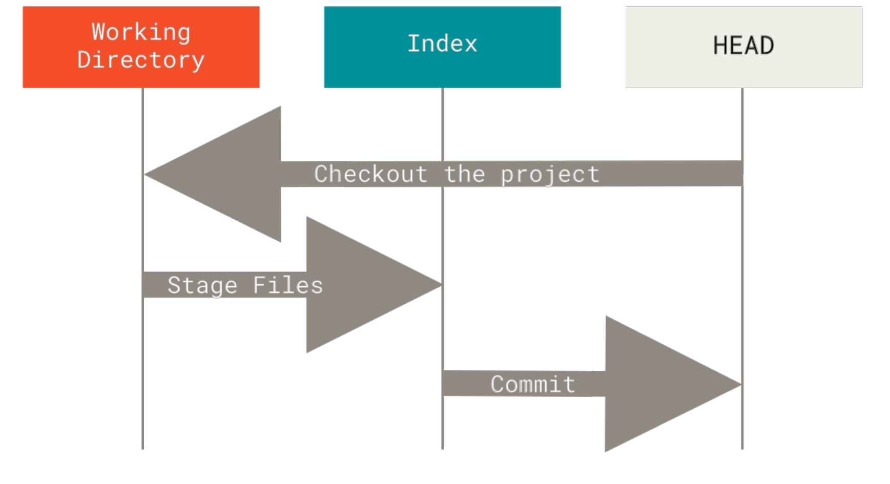
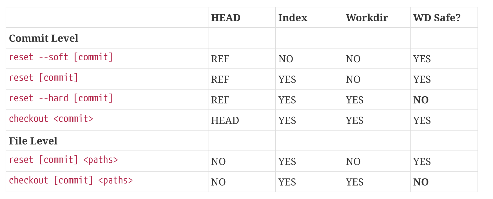

### Reset Demystified

Git tree -

- HEAD
- Index (Stage/Staging Area)
- working directory (“working tree”)

#### The Workflow



#### The HEAD

HEAD is the pointer to the current branch reference, which is in turn a pointer to the last commit
made on that branch. That means HEAD will be the parent of the next commit that is created. It’s
generally simplest to think of HEAD as the snapshot of your last commit on that branch.

#### The Index

The index is your proposed next commit. We’ve also been referring to this concept as Git’s “Staging
Area” as this is what Git looks at when you run git commit.

#### The Working Directory

Finally, you have your working directory (“working tree”). The
other two trees store their content in an efficient but inconvenient manner, inside the .git folder.
The working directory unpacks them into actual files, which makes it much easier for you to edit
them. Think of the working directory as a sandbox, where you can try changes out before
committing them to your staging area (index) and then to history.

The reset command overwrites these three trees in a specific order, stopping when you tell it to:

1. Move the branch HEAD points to (stop here if --soft).
2. Make the index look like HEAD (stop here unless --hard).
3. Make the working directory look like the index.

Git reset with file

```
git reset 23594b9e8363b9d042b88425d9275fce10cb9e21 -- composer.json
```

It just copy file from commit and put it in Index.  
When you run git commit you can see the result.
Or you can run clean working directory ```git restore .``` from changes and see the updated file.

The same thing can be done with checkout

```
git checkout ff39b9faaf04449f9028c9b013c29035475ee420 -- composer.json
```

### Check It Out

Like reset, checkout
manipulates the three trees, and it is a bit different depending on whether you give the command a
file path or not.

First, unlike reset --hard, checkout is working-directory safe; it will check to make sure it’s not
blowing away files that have changes to them. Actually, it’s a bit smarter than that — it tries to do a
trivial merge in the working directory, so all of the files you haven’t changed will be updated. reset
--hard, on the other hand, will simply replace everything across the board without checking.

The second important difference is how checkout updates HEAD. Whereas reset will move the
branch that HEAD points to, checkout will move HEAD itself to point to another branch.


