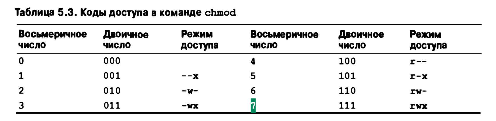

## 1.10 Поиск пакетов

- команды поиска пакетов - which < whereis
- Поиск файлов locate
- АРТ - Debian Advanced Package Tool.

# 2 Загрузка и системные демоны

- "самозагрузка" (bootstrapping)
- BIOS - Basic input/Output System
- BIOS был вытеснен более формализованным и современным стандартом - UEFI (мини OS)
- (ps -aux) процессы которые в скобках [] являются процессами ядра и не требует внимания со стороны админа

## Супервизор

Демон init (pid 1) следит за запуском служб и демонов
init в Ubuntu реализован через systemd (is a system and service manager for Linux operating systems)

Процессы в виде дерева ```ps auxf``` ```ps axjf```

- a - all process
- x - увидеть даже процессы, отсоединенные от управляющего терминала
- f - process hierarchy (forest/process tree)
- u - display user-name instead of PID.
- j - jobs format with ppid, uid

Для управления systemd -> systemctl

Для добавления службой поместить новый файл в каталог ```/etc/systemd/system```  
Затем можно запустить команду
```$ sudo systemctl enаblе custom custom.service```

# 3 Управление доступом и привилегии суперпользователя

Пространства имен Linux -> контейнерезация (Docker)
Система Linux может распределять процессы по иерархическим разделам
(пространствам имен), из которых видна только часть системных файлов, сетевых портов и процессов. Помимо прочего, эта
схема действует как форма превентивного контроля доступа. Вместо того чтобы основывать решения
управления доступом на потенциально тонких критериях, ядро просто отрицает существование объектов, которые не видны
изнутри данной области

# Управление процессами

- Ядро назначает каждому процессу уникальный идентификатор
- Идентификаторы PID присваиваются по порядку по мере создания процессов.
- Для того чтобы породить новый процесс,
  существующий процесс должен клонировать сам себя (системный вызов fork/clone). Клон может заменить выполняемую
  программу другой с помощью одного из системных вызовов семейства ехес
- каждый дочерний процесс имеет атрибут PPID ( Parent Process ID)
- Все процессы, кроме тех, что создаются ядром, являются потомками init или systemd
- Ядро системы требует, чтобы, прежде чем процесс окончательно исчезнет, его удаление было подтверждено родительским
  процессом с помощью системного вызова wait или systemd если родитель удален

## Удаление процессов

Удалить все процессы пользователя
```sudo pkill -u alex```

Удалить все процесс с именем phpstorm  
```sudo pkill -f phpstorm``` или
```kill -9 $(pgrep -f phpstorm)```

## 4.6 ФАЙЛОВАЯ СИСТЕМА /proc

Версии команд ps и top считывают информацию о состоянии процессов из
каталога /proc - псевдофайловой системы, в которой ядро помещает информацию о состоянии системы.

# Файловая система

- Файловое дерево может иметь произвольную глубину
- каждый компонент имени файла должен состоять не более чем из 255 символов.
- Существует также ограничение на длину пути, который вы можете передавать ядру в качестве аргумента системного вызова
  4095 байт в Linux

Network File System - NFS  
Common Internet File System - CIFS

Вывести все процессы которые взаимодействуют с файловой системой  
```fuser -cv /usr```

## Файлы символьных и блочных устройств

Файлы устройств позволяют программам получать доступ к аппаратным средствам
и периферийному оборудованию системы. Ядро включает (или загружает) специальные
программы (драйверы), которые во всех деталях "знают", как взаимодействовать с каждым из имеющихся устройств, поэтому
само ядро может оставаться относительно абстрактным и независимым от оборудования.  
Получив запрос к файлу символьного или блочного устройства, файловая система передает этот
запрос соответствующему драйверу. Важно отличать файлы устройств от драйверов этих
устройств. Файлы сами по себе не являются драйверами. Их можно рассматривать как шлюзы, через которые драйвер принимает
запросы.

## Локальные сокеты

Установленные посредством сокетов соединения позволяют процессам взаимодействовать, не подвергаясь влиянию других
процессов. В системе UNIX поддерживается не сколько видов сокетов, использование которых, как правило, предполагает
наличие сети.
Локальные сокеты доступны только на локальном компьютере, и обращение к ним
осуществляется через специальные объекты файловой системы, а не через сетевые порты. Иногда такие сокеты называют
UNIХ-сокетами. В качестве примеров стандартных средств, использующих локальные сокеты, можно назвать системы Х Window
и Syslog.
Локальные сокеты создаются с помощью системного вызова socket. Когда с обеих
сторон соединение закрыто, сокет можно удалить командой rm или с помощью системного вызова unlink.

## Права доступа к файлам



# 6 инсталляция и управление программным обеспечением

Список установленных пакетов ```dpkg -l``` 


