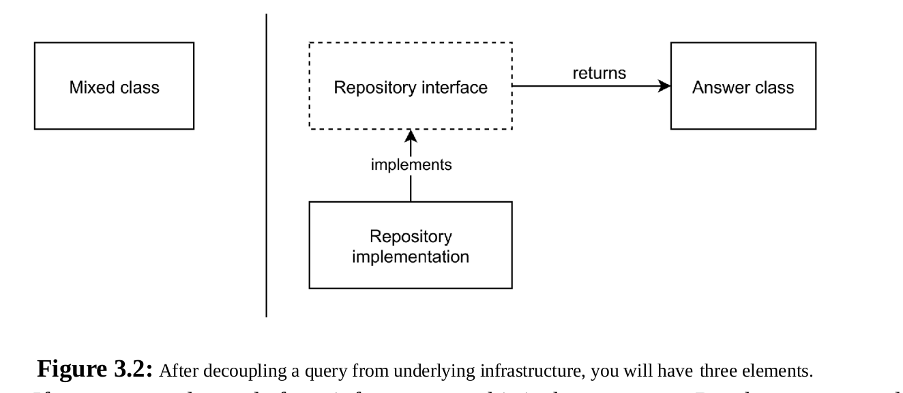

## 3 Read models and view models

### 3.1 Reusing the write model

If you start reusing an
object in different locations and for different reasons, the object starts to play too many roles at
the same time. The more roles an object has to play, the more methods and therefore lines of
code it will contain. Soon it becomes too big to read the code and understand what it does, let
alone to make changes to it. When the methods are calling each other, or when they rely on the
same object properties, it will be really difficult to change anything about it. Since many clients
are now using the object, they rely on its behavior to stay the same. It will be difficult to assess
whether a change is safe to make, or if it will break one of its clients which is still relying on
some undocumented existing behavior. Such an object becomes resistant to change, which is a
bad quality for objects in general.

A client that needs an object for getting information from (reading) should not
retrieve the same object as clients that want to make changes to it (writing).

### 3.2 Creating a separate read model

### 3.3 Read model repository implementations

#### 3.3.1 Sharing the underlying data source

#### 3.3.2 Using write model domain events

### 3.4 Using value objects with internal read models

### 3.5 A specific type of read model: the view model

View model will travel across our application’s boundaries, to the outside world, to actual users of our
application.
We should make it as easy as possible for any client
to show the data to actual users. Templates in particular shouldn’t need to know anything about
the domain objects that our application uses internally. This means our view model should only
return primitive-type values.
View model can be reused (template, cli) so we don't want to rewrite formatting logic in two places.
So keep it in view model or even early in repository.

### 3.7 Summary

In perfect world and code we should separate entity for write and read purpose.
Read model for internal usage.
View model for API, html templates and so on.

Read model can contain ValueObject.
View model should return ready to go values.

Decoupling Write model from Read introduce new classes and interfaces.

1. Model our query as a method on an interface. (good description of our question)
2. Model the result of that query as an object that gives us the exact answer we need.
3. Provide an implementation of the interface that can be used in production.
   
