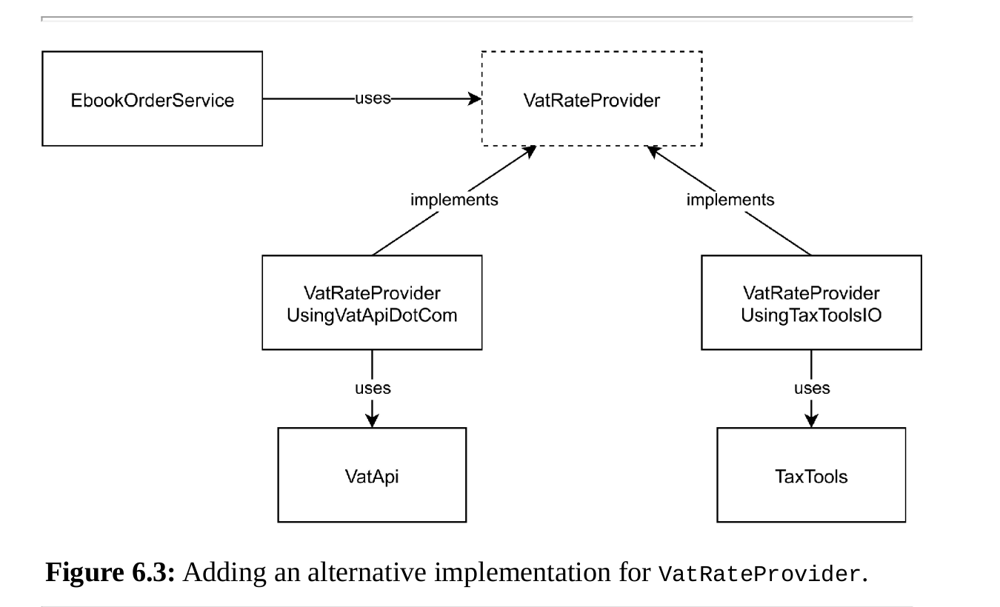

### 6.1 Connecting to the external service

### 6.2 Introducing an abstraction

### 6.3 Architectural advantages

Introducing an abstraction is a very helpful technique when you want to
move low-level implementation details out of sight, and focus instead on the
higher-level steps of a scenario.

When you are introducing abstractions for your service dependencies, make
sure to actually consider possible alternative implementations. Sometimes
the interface you have in mind is still too much tied to the implementation
you already have for it. Consider if the interface would still be useful if you
switch to a different web service, or when you’d start using a database table
instead of a remote service. Often little details about the underlying
implementation sneak into an interface, making it a less powerful abstraction.

### 6.4 Testing

Core code is code that doesn’t use IO (network, file system, etc.) (no side effects).  
code can be tested in complete isolation.

### 6.5 Summary
