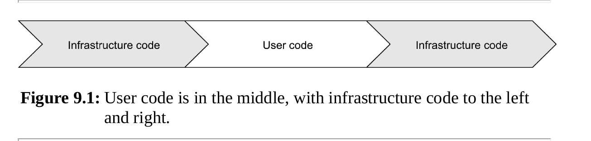
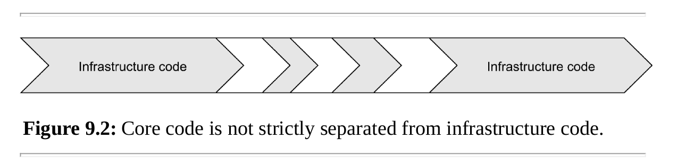
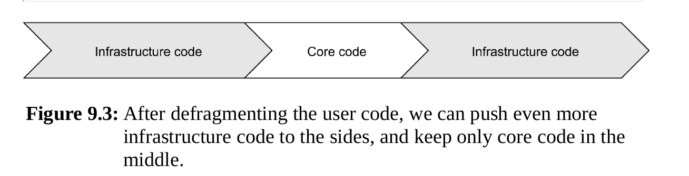
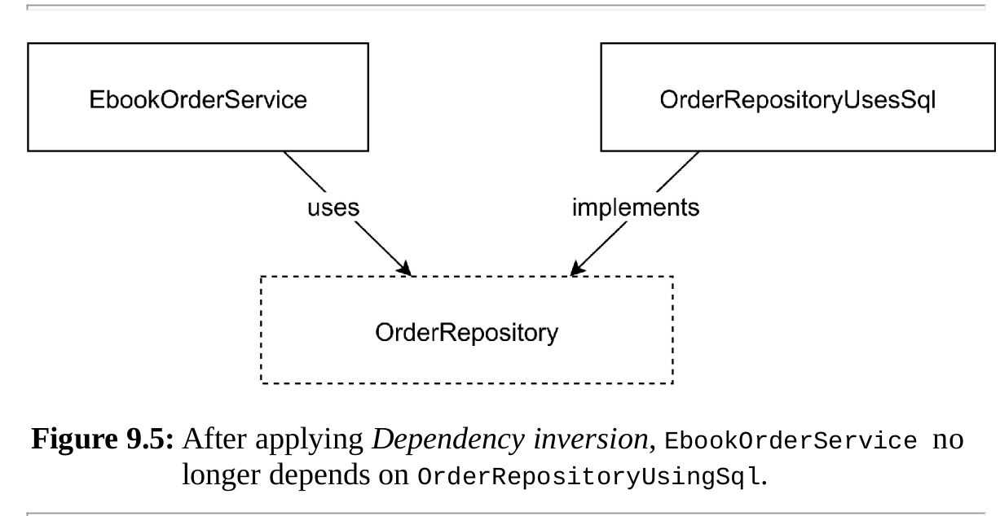
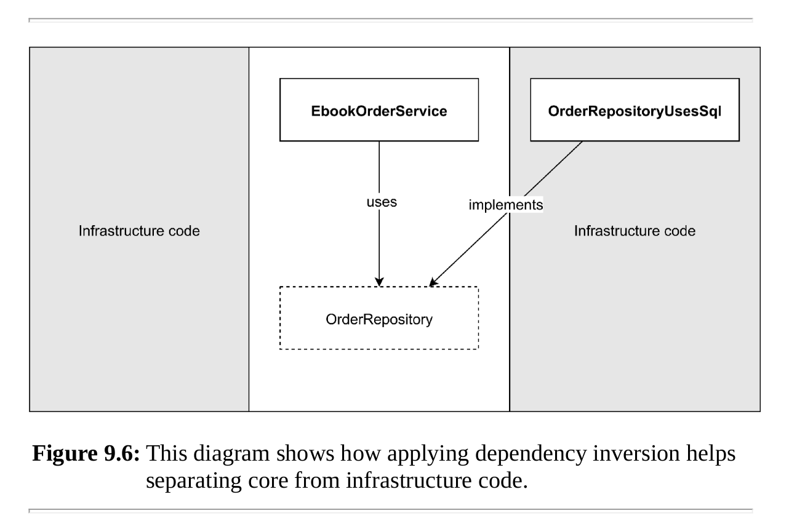
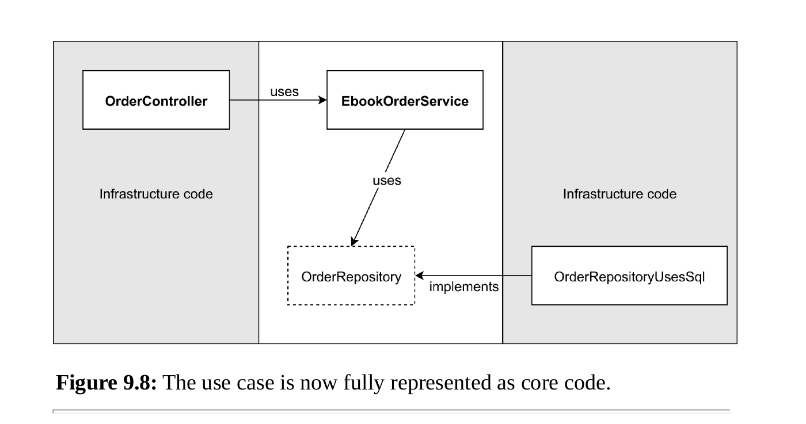
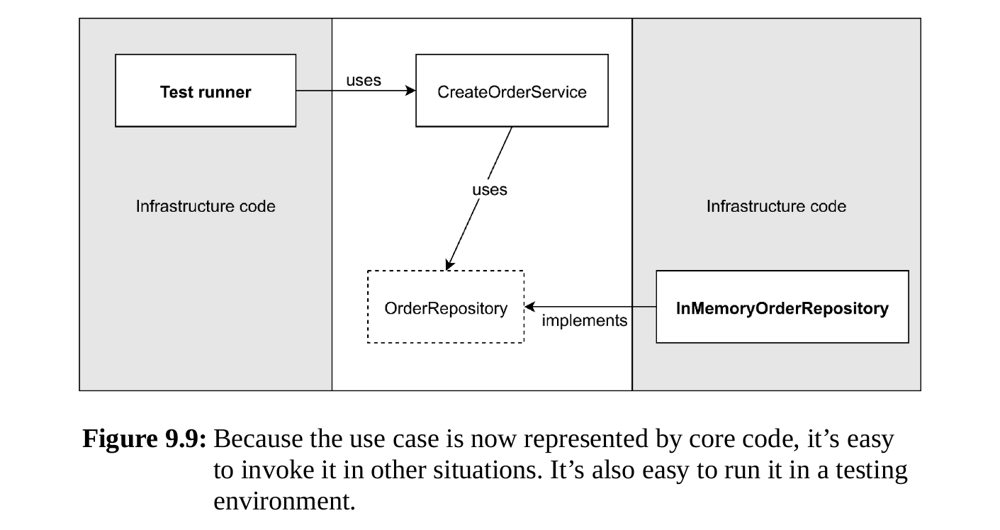

### 9.1 Core code and infrastructure code



Your own code, the so called user code.  
User code:

- User code is what makes your application special:
- it’s domain-specific: it’s your business logic



When I look at this diagram, I
immediately feel the urge to push the bits of infrastructure code to the sides.
Where they belong, I’d say, because infrastructure code is the code that
connects core code to the outside world so it might as well live as close the
outside world as possible.



### 9.2 A summary of the strategy

Separating core code from infrastructure code can be achieved by
applying the following principles:

- Use dependency injection everywhere, let services depend on
  abstractions only
- Make use cases independent of the delivery mechanism of their input

#### 9.2.1 Use dependency injection and inversion everywhere

- Dependency injection means that services will get everything they depend
  on (other services, as well as configuration values) injected as constructor arguments.
- Dependency inversion means that services depend on
  abstractions, instead of concrete classes



Core code never depends on infrastructure code, we can completely
replace the infrastructure code and the core would not be influenced by it.



#### 9.2.2 Make use cases universally invokable

- Many applications hide important use cases in their controllers.





### 9.3 Focus on the domain

Develop infrastructure and core code separate and with different speed

### 9.4 Focus on testability

### 9.5 Pure object-oriented code

Knowing when code is pure or not
will make a difference, because pure code can be unit-tested, and most of it
can end up in the core of your application.

In tests, we use Pure object-oriented code.

```php
interface Timer
{
    public function currentTimestamp(): int;
}

final class TimerUsesSystemClock implements Timer
{
    public function currentTimestamp(): int
    {
        return time();
    }
}

final class FakeTimer implements Timer
{
    private int $timestamp;
    
    public function __construct(int $timestamp)
    {
        $this−>timestamp = $timestamp;
    }
    
    public function currentTimestamp(): int
    {
        return $this−>timestamp;
    }
}

final class Stopwatch
{
    private Timer $timer;
    
    public function __construct(Timer $timer)
    {
        $this−>timer = $timer;
    }
    
    public function secondsPassed(int $previousTimestamp): int
    {
        return $this−>timer−>currentTimestamp() − $previousTimestamp;
    }
}

```

### 9.6 Summary

