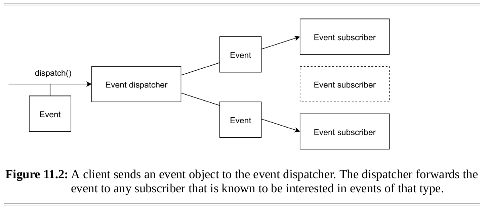
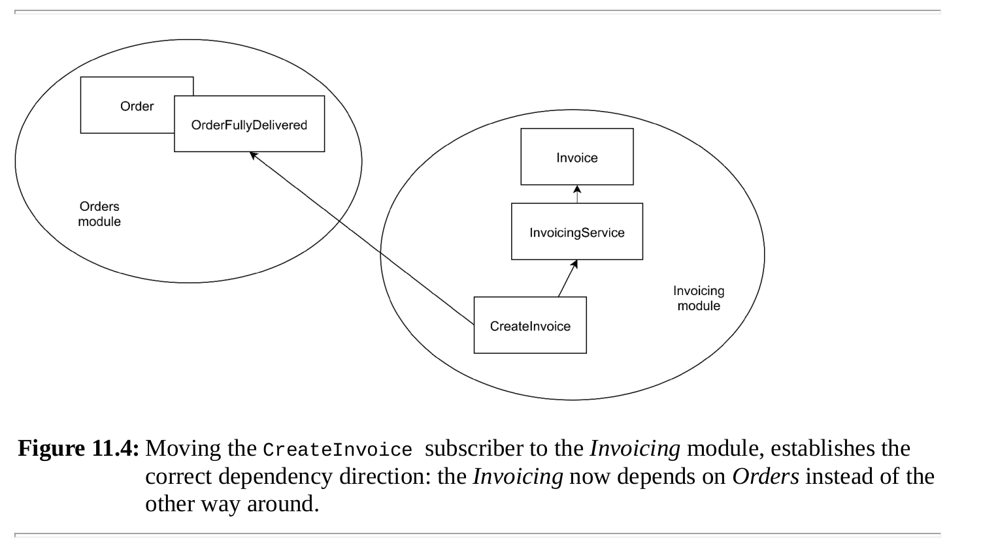
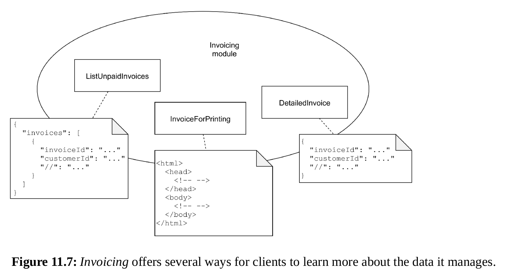
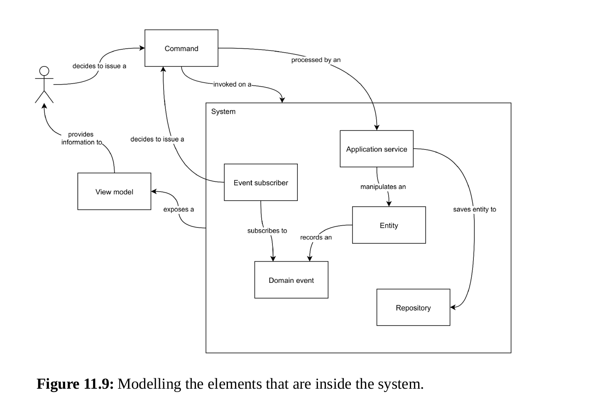

## 11 Key design patterns

### 11.1 Framework-inspired structural elements

### 11.2 Entities

The first pattern to cover is the Entity pattern.
In this book the concept of an entity is the same as the concept of an aggregate in Domain-Driven Design literature.

- Entities are objects that preserve the state of your application.
- They are the only type of objects in your application that have persistent state.
- Most of the other objects should be designed to be immutable and stateless.
- Being mutable, entities should not be passed to clients that don’t intend to change their state.
- When a client needs to retrieve information from an entity, in most
  cases they should rely on a different type of object, that is, a Read model.
- The only type of client that is supposed to modify an entity is an Application service

#### 11.2.1 Protect invariants

An entity should always protect its domain invariants (the things that are always true about it)
and make sure that it’s in a consistent state. It should never contain invalid, incomplete, or
meaningless data. Entities are meant to establish a basic level of consistency for your
application, as well as protecting it against data corruption.

#### 11.2.2 Constrain updates

#### 11.2.3 Model state changes as actions with state transitions

As an example, an order may be cancelled, but only if it hasn’t been delivered yet. Instead of a
setCancelled() method, an Order entity would have a cancel() method, which performs the
required checks.
Methods that change the state of the entity, or perform an action on it, should both be Command
methods, that is, they should have a void return type.

#### 11.2.4 Don’t think too much about tables

Mapping the data to any kind of database should be a separate task. Your entity should in the
first place be a well-designed object regardless of the database that will eventually support
storing it.

#### 11.2.5 Record domain events

Keep an internal record of Domain events that have happened to the entity, like “Order was
created”, “Order was cancelled”, etc. Domain events are simple immutable objects which are
named after the event they represent, e.g. OrderWasCreated, OrderWasCancelled, etc. After
saving the entity, it should be possible to retrieve a collection of these event objects so you can
dispatch them and let other parts of the application respond to them.

### 11.3 Repositories

Every entity needs a repository. Because a repository crosses the application boundary to save
and load entities it should be a service abstraction. This means the repository should be defined
as an interface (e.g. OrderRepository). It also needs a standard implementation that
implements the interface and the contract described by it.

### 11.4 Application services

The Order entity can be created, you can change its delivery address, cancel it, etc. These
behaviors are represented by command methods, with an intention-revealing name. Only
Application services should have access to these methods. An application service coordinatesthe requested change.

#### 11.4.1 Return the identifier of a new entity

Application service methods are command methods: they change entity state and shouldn’t
return anything. However, when an application service creates a new entity returning id is fine.
But service should not return hole entity.
If you need some information in response fetch read model ad in example.

```php
final class OrderController
{
    // ...
    public function createOrderAction(Request $request): Response
    {
        $orderId = $this−>orderService−>createOrder(/∗ ... ∗/);
        $order = $this−>orderDetailsRepository−>getById($orderId);
        return $this−>templateRenderer−>render(
            ’order−details.html.twig’,
            [’order’ => $order]
        );
    }
}
```

#### 11.4.2 Input should be defined as primitive-type data

#### 11.4.3 Wrap input inside command objects (Parameter object|DTO)

#### 11.4.4 Translate primitive input to domain objects

An application service has to translate the primitive-type values from the DTO to the value objects (rich domain
objects) that the entity can work with.

It can be done inside DTO

This approach has several advantages:

1. There’s less noise inside the application service because it doesn’t have to deal with all
   the type conversions itself.
2. The getters on the command DTO can be called multiple times inside the application
   service. There’s no need to duplicate the instantiation logic.

#### 11.4.5 Add contextual information as extra arguments

Contextual data like the current user’s ID, data from the current HTTP request, etc. should not
be fetched when needed, nor should it be injected as constructor arguments of the application
service. Instead, contextual information should always be provided as method arguments.

#### 11.4.6 Save only one entity per application service call

#### 11.4.7 Move secondary tasks to a domain event subscriber

After saving an entity the event dispatcher should receive all the recorded domain events. The
event dispatcher will then notify all the event subscribers that have been registered for that
particular event.


```php
public function changeDeliveryAddress(OrderId $orderId, ChangeDeliveryAddress $command): void 
{
    // ...
    $order−>changeDeliveryAddress(
        DeliveryAddress::fromScalars(
            $command−>address,
            $command−>postalCode,
            $command−>city,
            $command−>country
        )
    );
    
    $this−>orderRepository−>save($order);
    $this−>eventDispatcher−>dispatchAll($order−>releaseEvents());
}
```

### 11.5 Event subscribers

#### 11.5.1 Move subscribers to the module where they produce their effect

The class name of an event subscriber should describe what it’s going to do, e.g. “create an
invoice” (Listing 11.19). The methods of the event subscriber should describe when it’s going
to do this. Doing so allows you to move event subscribers to the area where they produce their
effect.



#### 11.5.2 Delegate to an application service

Delegate work from subscribers to an application service or infrastructure service.

### 11.6 Read models

While application services deal with entities, which are write models, a client that needs
information from an entity shouldn’t use the entity itself but a dedicated Read model instead.

#### 11.6.1 Use internal read models when you need information

#### 11.6.2 Choose a standard implementation for the repository

Whatever changes are made outside of the module, as long as the repository implementation is
able to provide the right read model objects, everything should be fine. It’s like the Dependency
Inversion Principle applied to models. Even if the Orders module gets replaced by a third-party
platform for selling e-books, the Invoicing module doesn’t need to suffer. The only thing that
needs to be done is rewrite the OrderRepository implementation to use the third-party
platform’s API to retrieve information about an order. This makes the use of
read models as local representations of remote entities a very powerful architectural technique.

#### 11.6.3 For view models, prepare the data for rendering

Figure below shows these different view models that Invoicing offers to its actors.

The view models themselves need to be fully prepared for the view that renders them to the user.

### 11.7 Process modelling



### 11.8 Summary

