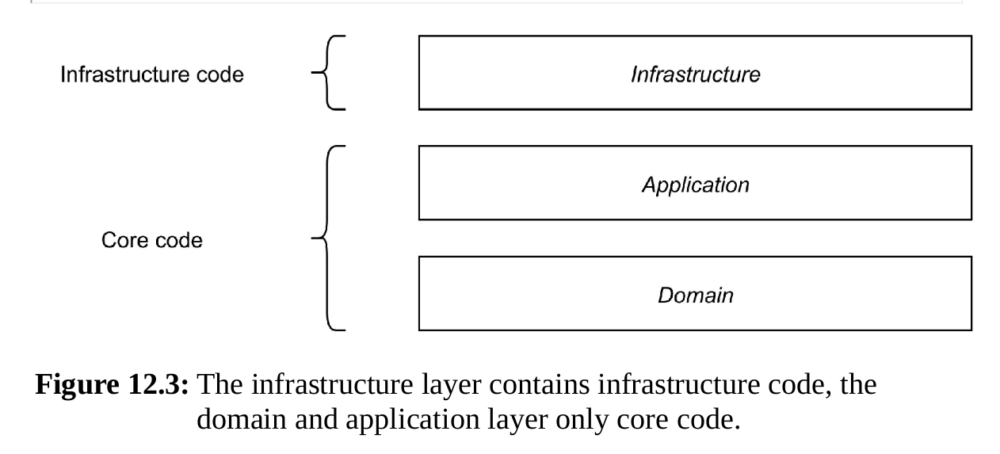
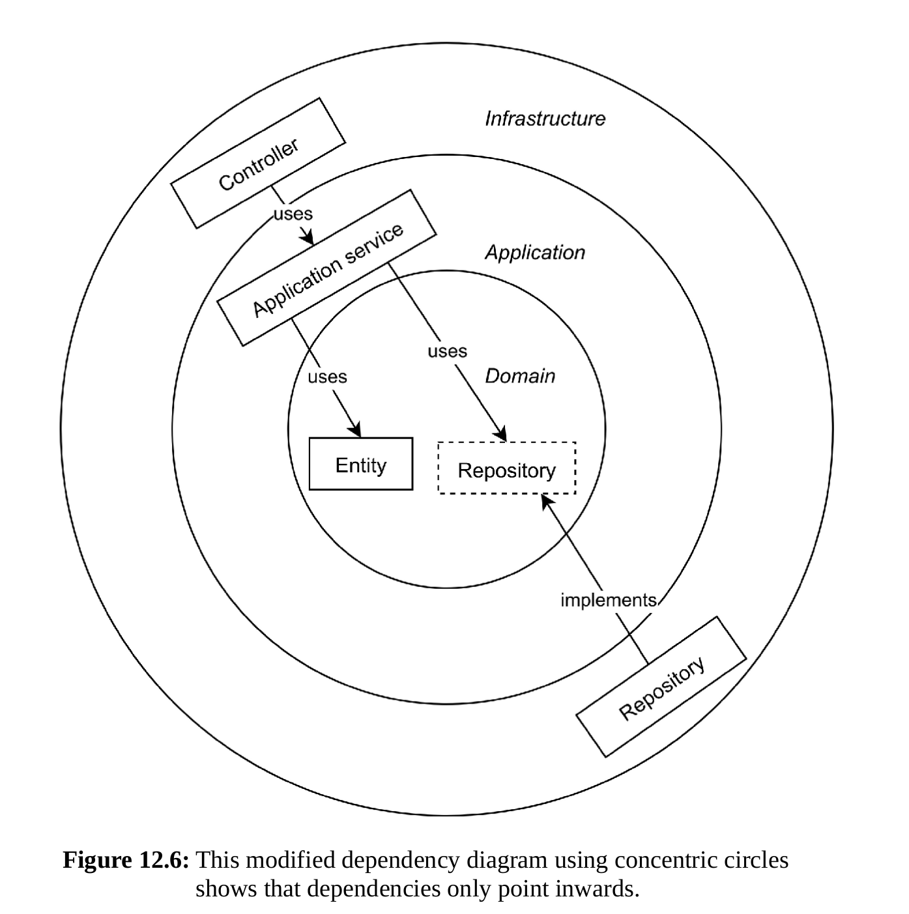
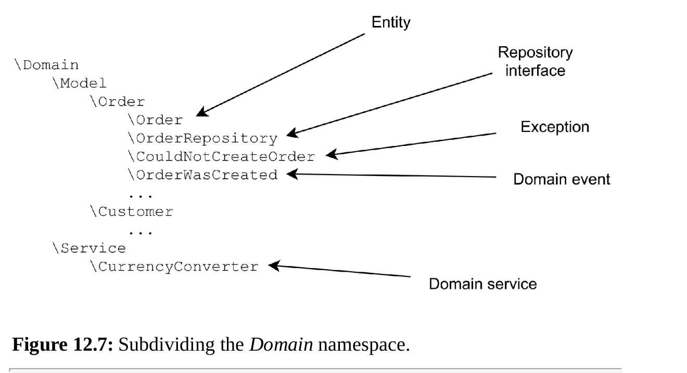
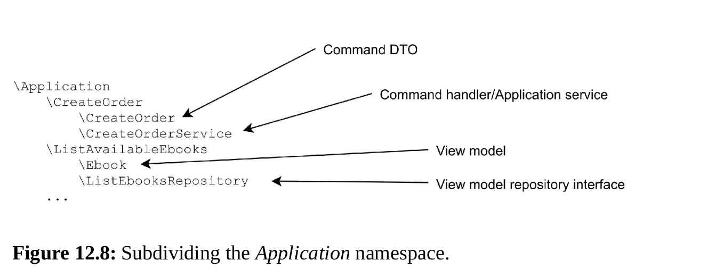

## 12 Architectural layers

### 12.1 MVC

Popular case of MVC realization -
Controllers are small, as they should be, but services become
too big. Models are still simple data holders.

So even after inventing an extra “service layer”, MVC is still lacking.
For example, it doesn’t help us separate a use case in a primary action and its
secondary effects.

### 12.2 A standard set of layers

#### 12.2.1 The infrastructure layer

- Web controllers
- CLI commands
- Write and read model repository implementations
- Services that connect to external systems, like a remote API, or the file system
- Services that use the current time or generate random data

#### 12.2.2 The application layer

- Application services/command handlers, and command DTOs
- View model repository interfaces, and view model DTOs
- Event subscribers that listen to domain events and perform secondary tasks
- Interfaces for infrastructure services

Looking at the classes in the application layer you should be able to
recognize:

- What actors can do with your application and what data an actor has to
  provide for each task (represented by the application services and their
  method parameters, which could be command DTOs).
- What an actor can learn from your application (represented by the view
  model repository interfaces and the view model objects).
- How different use cases are connected to each other (represented by the event subscribers).
- On which things in the outside world your use cases depend
  (represented by the interfaces for infrastructure services).

#### 12.2.3 The domain layer

- Entities
- Value objects
- Domain events
- Entity (write model) repository interfaces
- Domain services

Links between layers:

- infrastructure layer -> application layer -> domain layer
- infrastructure layer <- application layer <- domain layer

These domain objects should be considered implementation details of the
application layer. In fact, most of these details should stay behind the
application layer. The infrastructure layer generally shouldn’t be concerned
with anything that’s going on in the domain layer. Infrastructure code, like a
web controller, should mainly have to deal with primitive-type data (or
DTOs containing primitive-type data) when it communicates with the
application layer. The application layer will use code from the domain layer
to perform its task, and it will know about the rich domain objects it contains.

#### 12.2.4 Up and down the layer stack

1. The web framework (infrastructure layer) accepts an incoming HTTP
   request.
2. It analyzes the request and finds the right controller (infrastructure
   layer) to call.
3. The controller creates a DTO based on the data from the request and
   calls an application service (application layer).
4. The application service creates or modifies an entity (domain layer).
5. The application service then hands over the entity to its repository
   (infrastructure layer), in order to save it.

### 12.3 The Dependency rule

The dependency arrows only point inwards: from Infrastructure to
Application, from Application to Domain; never the other way around. This
is a great design tool for a software architect like yourself, because you can
reconnect your application to different types of actors without affecting the
classes that are in the Application or Domain layer.  
If there are no
dependencies upwards, this means we can rewrite or replace higher layerswithout affecting the lower ones.

### 12.4 Making layers tangible

#### 12.4.1 Documenting the architecture

#### 12.4.2 Using namespaces for layering

Examples 

#### 12.4.3 Automated verification of design decisions

There are tools to help truck layering structure - deptrac.

#### 12.5 Summary
