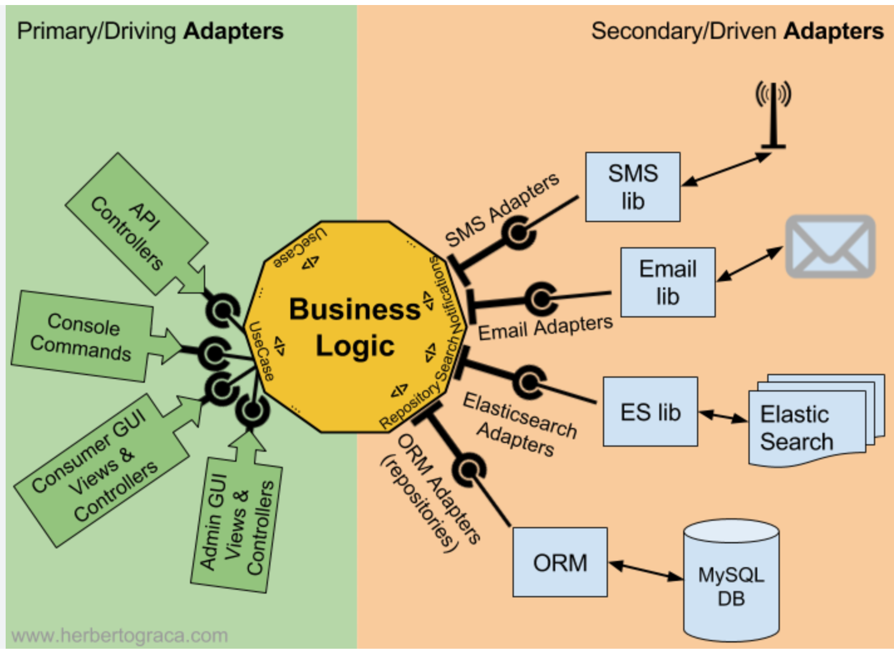
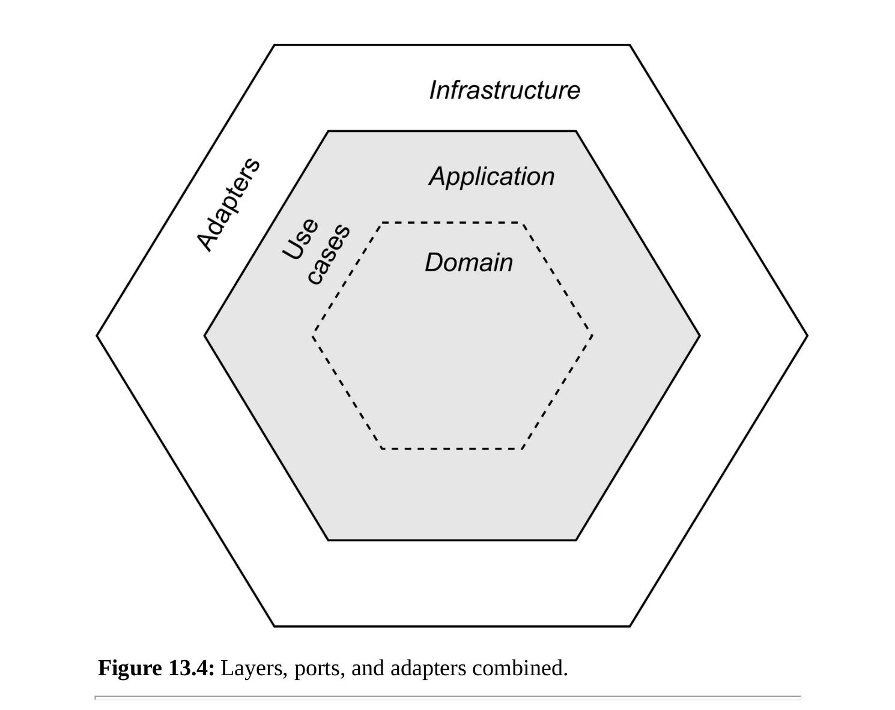
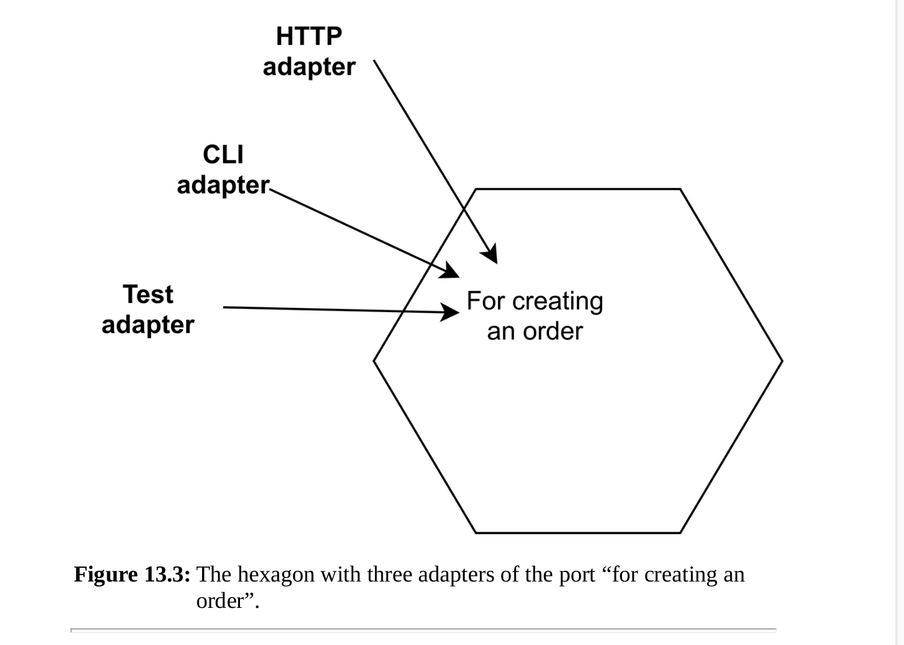

## 13 Ports and adapters

### 13.1 Hexagonal architecture

Alistair Cockburn describes the intent of this architectural style as follows:  
_Allow an application to equally be driven by users, programs,
automated test or batch scripts, and to be developed and tested in
isolation from its eventual run-time devices and databases._

### 13.2 Ports

A primary actor is an actor that takes the
initiative for communication. An example of a primary actor is a user who
visits our web page, or an external system that talks to one of our API
endpoints. When our application reaches out to an external system, for
instance the database or a mail server, the external system should be
considered a secondary or supporting actor.  
With hexagonal architecture all the use cases are core code and they live
inside the Hexagon. Whenever a primary actor needs to invoke one of the
application’s use cases the application should define a Port for that.
Whenever a use case needs to communicate with a supporting actor, like the
database, we also have to define a Port for that. A port is an “intention of
communication”. For example: our application may have a port “for creating
an order” which can be used by primary actors to create an order. Our
application will also have a port “for saving an order” which indicates that
the application needs a supporting actor for saving orders.  
Port == interface  
Every port will have a corresponding interface element inside the hexagon.

A hexagon with ports alone is not enough to build a working application. A
port is only an intention, now we need an implementation. In Cockburn’s
terminology the implementation of a port is called an Adapter.

### 13.3 Adapters for outgoing ports

outgoing adapters (sometimes called “drivers”)

An adapter often isn’t a single class. All the collaborating objects should be
considered part of the adapter too. For instance, if your OrderRepository
implementation uses Doctrine ORM to store the Order entity, all of
Doctrine ORM should be considered part of the adapter. Without it, the
adapter wouldn’t be functioning properly.  
Since an outgoing port is defined in your code by an interface it’s a
natural option to provide alternative implementations for that interface, or in
hexagonal terms: to provide an alternative adapter for the port. This is what
hexagonal architecture is actually aiming for: the ability to replace adapters
in order to make testing of the hexagon easier.

### 13.4 Adapters for incoming ports

On the other side of the hexagon are the incoming ports. These are meant to
accept incoming messages from users or external systems.

The controller itself and code before it is also part of the adapter, since the controller is specifically designed for
HTTP communication. It uses web-specific objects and services like the current request or the user’s session.
As soon as the controller calls an
application service, we step out of the adapter and into the hexagon.
This is only true for as long as the application service itself is indeed fully
decoupled from its delivery mechanism and the framework.

In fact, the test code itself should be considered an adapter since it
communicates directly with the port.

For getting data we can use the same approach.
Get data from Hexagon (core code) as simple object (DTO), and then adapters convert this data to actor needed format (JSON, xml ...)

### 13.5 The application as an interface

