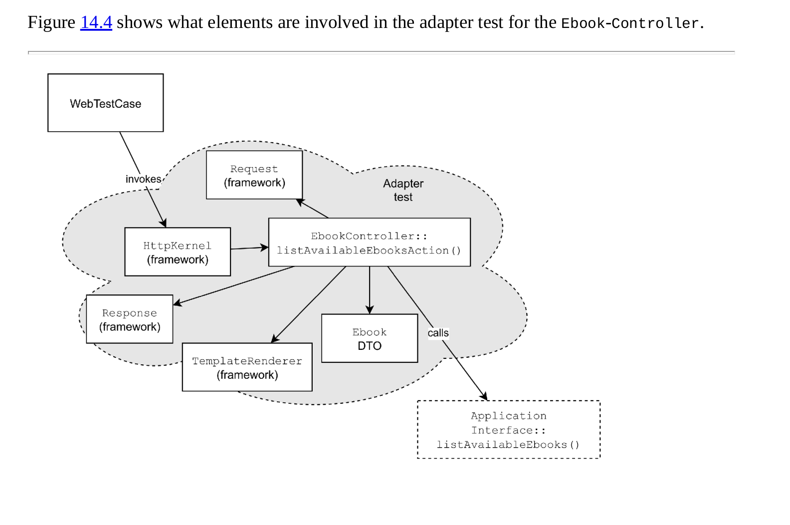

## 14 A testing strategy for decoupled applications

### 14.1 Unit tests

Writing a unit test is a way to zoom in on the behavior of some of the system’s smaller elements.

Michael Feathers in his definition of a unit test.  
A test is not a unit test if:

1. It talks to the database
2. It communicates across the network
3. It touches the file system
4. It can’t run at the same time as any of your other unit tests
5. You have to do special things to your environment (such as editing config files) to
   run it.

Generalize - a test is not a unit test if it invokes infrastructure code.

- unit tests == “isolated tests”
- move the tests that invoke infrastructure code to a different test suite called “integration tests”

I usually write isolated tests only for some smaller building blocks like entities and value objects to protect all
kinds of domain invariants

I don’t write unit tests for objects that coordinate changes in domain objects, like
application services, event subscribers, and repositories. These will be tested with Use case tests and Adapter tests.

### 14.2 Adapter tests

Infrastructure tests are
often called integration tests, or integrated tests. These tests show that infrastructure code
including third-party code correctly integrates with external actors

### 14.3 Contract tests for outgoing port adapters

Outgoing ports are defined by separate
interfaces, like the OrderRepository that can save an entity, and the VatRateProvider that
we’ve used earlier to determine the VatRate of a product.

The test methods should only call methods that are
defined on the interface. This guarantees that the implementations follow the Liskov
Substitution Principle, i.e. they can seemingly act as replacements for each other.

Listing 14.3: Part of the contract test for the OrderRepository.

```php
final class OrderRepositoryContractTest extends TestCase
{
    /∗∗
    ∗ @test
    ∗ @dataProvider orders
    ∗/
    public function it_can_save_and_load_order_entities(Order $order): void
    {
        foreach ($this−>orderRepositories() as $orderRepository) {
            $orderRepository−>save($order);
            
            $fromRepository = $orderRepository−>getById($order−>orderId());
            
            self::assertEquals($order, $fromRepository);
        }
    }
    
    /∗∗
    ∗ @return Generator<OrderRepository>
    ∗/
    private function orderRepositories(): Generator
    {
        yield new InMemoryOrderRepository();
        yield new OrderRepositoryUsingDoctrineDbal(/∗ ... ∗/);
    }
    
    // yield any other implementation you have
    /∗∗
    ∗ @return Generator<array<Order>>
    ∗/
    public function orders(): Generator
    {
        yield [Order::create(/∗ ... ∗/)];
        yield [Order::create(/∗ ... ∗/)−>cancel()];
        yield [Order::create(/∗ ... ∗/)−>markAsPaid()];
        // yield any other ‘Order‘ entity that you might want to save
    }
    
// ...
}
```

When communicating with external services that are not managed by you or your team this can
be really hard to do without sacrificing some test stability. Here’s what I usually try:

1. Write the test against the real service
2. Write the test against a sandbox environment the third party offers
3. Write the test against a fake server that I run
4. Write the test against a fake or mock HTTP client offered by the client library that I use
5. Write the test against a fake or mock of the HTTP client interface that I use

### 14.4 Driving tests for incoming port adapters

For hexagonal architecture we test separate core code and adapters code.
For adapters, we can use integration test/adapters test.
Core code allows itself to be tested with unit tests or use case tests.

So when testing incoming port adapters we should use test doubles for application interface.

Adapter tests are integration tests and are by definition slower and less stable than isolated tests.

A test for the EbookController.

```php
use Symfony\Bundle\FrameworkBundle\Test\WebTestCase;
final class EbookControllerTest extends WebTestCase
{
    public function it_renders_a_list_of_ebooks(): void
    {
        $ebooks = [
            EbookBuilder::create()
                −>withTitle(’Advanced Web Application Architecture’)
                −>build()
        ];
        
        $application = $this−>createMock(ApplicationInterface::class);
        $application−>expects($this−>any())
            −>method(’listAvailableEbooks’)
            −>will($this−>returnValue($ebooks));
            
        $client = self::createClient();
        $client−>getContainer()−>set(
            ApplicationInterface::class,
            $application
        );
        $crawler = $client−>request(’GET’, ’/list−available−ebooks’);
        self::assertStringContainsString(
            ’Advanced Web Application Architecture’,
            $crawler−>filter(’.ebook−title’)−>text()
        );
    }

}
```

A builder for Ebook read model objects.

```php
final class EbookBuilder
{
    private string $id = ’ad5075f1−be24−4ae1−8ba8−9efec6f4933b’;
    private int $price = 2500;
    private string $title = ’The title’;
    
    private function __construct() {}
    
    public static function create(): self
    {
        return new self();
    }
    
    public function withTitle(string $title): self
    {
        $this−>title = $title;
        return $this;
    }
    
    public function build(): Ebook
    {
        return new Ebook(
            EbookId::fromString($this−>id),
            new Money($this−>price, new Currency(’EUR’)),
            $this−>title
        );
    }
}

```



### 14.5 Use case tests

Use case tests - test use cases, but most importantly they document the primary actions and their effects.

### 14.6 End-to-end tests

End-to-end tests - test that verifies that all these parts work well together once the application runs in a production
environment. From one end of the deployed application to the other end.

- An end-to-end test should treat the application as a black box
- In the case of a web application, it may only send HTTP requests and inspect responses.
- It should not take a peek inside the database or anything.
- It’ll be smart to only write a few end-to-end tests because they tend to be slow and unstable.

### 14.7 Development workflow

- It works best to start with a high-level specification of the feature that you’re going to work on.

- What are the different scenarios that need to be implemented?
- Challenge these scenarios, come up with possible edge cases.
- Then write them down in Gherkin.

ideal scenario:

- Developer discusses the feature with the other stakeholders.
- The developer then write scenarios that reflect their understanding of the feature.
- When reading the scenarios, other stakeholders can verify that everybody has a shared
  understanding of what needs to be done.
- Just like writing the high-level scenarios first, designing the high-level elements first may
  also save a lot of time spent on building the wrong solution.
- Instead of jumping right into the code, the process can be modelled in pseudo-code first.
- Once the design is somewhat clear it makes sense to start programming


- The programming itself should be test-driven.

For me this top-down approach to application development is great because:

- It starts with collaboration: developers and other stakeholders work together to establish a
  shared understanding of what needs to be created.
- When developers start out to build a feature, they focus on the structural elements first,
  without building them yet.
- The scenarios that were written to establish that shared understanding can now be used to
  verify step by step that the implemented solution is the one that was asked for; you won’t
  end up building the wrong thing. You’ll know automatically when the work is done, so you
  won’t build more than needed.
- Using different types of tests you can zoom in on specific parts, e.g. smaller objects like
  entities, or specific port adapters. You don’t have to test domain logic through slow and
  unstable end-to-end tests.
- Confidence in the solution is very high. Running the test suite for a given feature proves
  that everything works, and keeps working.

### 14.8 Summary

Testing a decoupled application requires several different types of tests. In the first place there
will be Use case tests that describe the behavior of the application core. Running these tests
involves only core code. You can specify the behavior of smaller elements like entities and
value objects inside the core with Unit tests. An application exposes a number of incoming
ports and requires a number of outgoing ports. The adapters for these ports will be tested with
Adapter tests. Adapter tests aren’t unit tests because they involve infrastructure code; non-unit
tests are often called integration or integrated tests. To verify that all the parts work well
together you may add a number of End-to-end tests, which use the application as a real user
would, in an environment that mimics as much as possible the production environment.