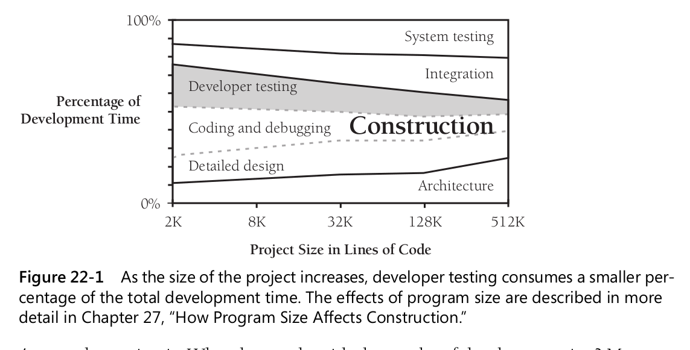

# 20 The Software-Quality Landscape

## 20.1 Characteristics of Software Quality

External characteristics of quality are the only kind of software characteristics that
users care about.  
External characteristics:

- Correctness
- Usability
- Efficiency
- Reliability
- Adaptability

Internal characteristics:

- Maintainability
- Flexibility
- Portability
- Reusability
- Readability
- Testability
- Understandability

The attempt to maximize certain characteristics inevitably conflicts with the attempt to
maximize others. Finding an optimal solution from a set of competing objectives is one
activity that makes software development a true engineering discipline.

### 20.2 Techniques for Improving Software Quality

- Software-quality objectives  
  Set explicit quality objectives from among the external and internal characteristics. Without explicit goals,
  programmers might work to
  maximize characteristics different from the ones you expect them to maximize.
- Explicit quality-assurance activity  
  One common problem in assuring quality is that
  quality is perceived as a secondary goal. Indeed, in some organizations, quick and
  dirty programming is the rule rather than the exception.
- Testing strategy
- Software-engineering guidelines  
  Guidelines should control the technical character
  of the software as it’s developed. Such guidelines apply to all software development
  activities, including problem definition, requirements development, architecture, construction, and system testing.
- Informal technical reviews (pair programming)
- Formal technical reviews (CR)
- External audits

One big obstacle to achieving software quality is uncontrolled changes. Uncontrolled changes in design can result in
code that doesn’t agree with its requirements, inconsistencies in the code, or more time spent modifying code to meet
the changing design than spent moving the project forward.

Gerald Weinberg and Edward Schulman conducted a fascinating experiment to investigate the effect on programmer
performance of setting quality objectives (1974)

- Minimum memory
- Output readability
- Program readability
- Least code
- Minimum programming time

The results of this study were remarkable. Four of the five teams finished first in the
objective they were told to optimize. The other team finished second in its objective.
None of the teams did consistently well in all objectives.

Studies at NASA’s Software Engineering Laboratory, Boeing, and other companies have
reported that different people tend to find different defects.
The upshot is that defect-detection methods work better in combination than they do singly.

That isn’t true because the longer a defect remains in the system, the more expensive it
becomes to remove. A detection technique that finds the error earlier therefore results in
a lower cost of fixing it.

Code reviews were several times as cost-effective as testing.
The bottom line is that an effective software-quality program must include a combination of techniques that apply to all
stages of development. Here’s a recommended
combination for achieving higher-than-average quality:

- Formal inspections of all requirements, all architecture, and designs for critical
  parts of a system
- Modeling or prototyping
- Code reading or inspections
- Execution testing

Reducing debugging by preventing errors improves productivity. Therefore, the most obvious method
of shortening a development schedule is to improve the quality of the product and
decrease the amount of time spent debugging and reworking the software.

### 21 Collaborative Construction

- “Collaborative construction” refers to pair programming, formal inspections, informal
  technical reviews, and document reading, as well as other techniques in which developers share responsibility for
  creating code and other work products.

- Developers are blind to some of the trouble spots in their work, that other
  people don’t have the same blind spots

- A secondary effect is that when people know their work will be reviewed, they scrutinize it more carefully.

## 22 Developer Testing

### 22.1 Role of Developer Testing in Software Quality

### 22.2 Recommended Approach to Developer Testing

- Design the test cases along with the product.  
  This can help avoid errors in requirements and design, which tend to be
  more expensive than coding errors.
- Plan to test
  and find defects as early as possible because it’s cheaper to fix defects early.

Test First or Test Last?

- Writing test cases before writing the code doesn’t take any more effort than writing test cases after the code
- Writing test cases first forces you to think at least a little bit about the requirements and design before writing
  code, which tends to produce better code.
- Writing test cases first exposes requirements problems sooner, before the code
  is written, because it’s hard to write a test case for a poor requirement.
- When you write test cases first, you detect defects earlier and you can correct
  them more easily.

The art of testing is that of picking the test cases most likely to find errors.

### 22.4 Typical Errors

- 80 percent of the errors are found in 20 percent of a project’s classes or routines (Endres 1975, Gremillion 1984, Boehm 1987b, Shull et al 2002).
- 50 percent of the errors are found in 5 percent of a project’s classes (Jones 2000).

- In the long run, the best way to improve your testing process is to make it regular, measure it, and use what you
  learn to improve it.
- Test data tends to have a higher error density than the code being tested.

## 23 Debugging

Debugging is the process of identifying the root cause of an error and correcting it.
It contrasts with testing, which is the process of detecting the error initially.

- In general, the practice allows excellent programmers to narrow their search fields and find defects more quickly
- Understand the root problem before you fix the program

## 24 Refactoring

### 24.1 Kinds of Software Evolution

- Software evolution is like biological evolution in that some mutations are beneficial
  and many mutations are not.
- The key distinction between kinds of software evolution is whether the program’s
  quality improves or degrades under modification.

### 24.2 Introduction to Refactoring

- Change in itself is not a virtue, but purposeful change, applied with a teaspoonful of discipline, can be the key
  strategy that supports steady improvement in a program’s quality
  under maintenance and prevents the all-too-familiar software-entropy death spiral.

### 24.3 Specific Refactorings

### 24.4 Refactoring Safely

- Don’t use refactoring as a cover for code and fix  
  Refactoring refers to changes in working code that do not affect the program’s behavior.
  Programmers who are tweaking broken code aren’t refactoring; they’re hacking.
- Avoid refactoring instead of rewriting

### 24.5 Refactoring Strategies

- Spend your time on the 20 percent of the refactorings that provide 80 percent of the benefit.

## 25 Code-Tuning Strategies

### 25.2 Introduction to Code Tuning

The team who designed the ALGOL language advice - “The best is the enemy of the good.”

20 percent of a program’s routines consume 80 percent of its execution time.  
Donald Knuth found that less than 4 percent of a program usually accounts for more than 50 percent of its run time.

Programmers are very bad at guessing which four percent
of the code accounts for 50 percent of the execution time, and so programmers
who optimize as they go will, on average, spend 96 percent of their time optimizing code that doesn’t need to be
optimized.

Use a high-quality design. Make the program right. Make it modular and easily modifiable so that it’s easy to work on
later. When it’s complete and correct, check the performance. If the program lumbers, make it fast and small. Don’t
optimize until you know you need to.

## 26 Code-Tuning Techniques

anti-refactorings

- Putting the Busiest Loop on the Inside
- Substitute table lookups for complicated logic.
- Jam loops
- Stop testing when you know the answer.
- Compare performance of similar logic structures.
- Minimize array references.
- Reduce strength in logical and mathematical expressions. (addition cheaper than multiplication)
- Translate key routines to a low-level language.

Code tuning is a little like nuclear energy. It’s a controversial, emotional topic.