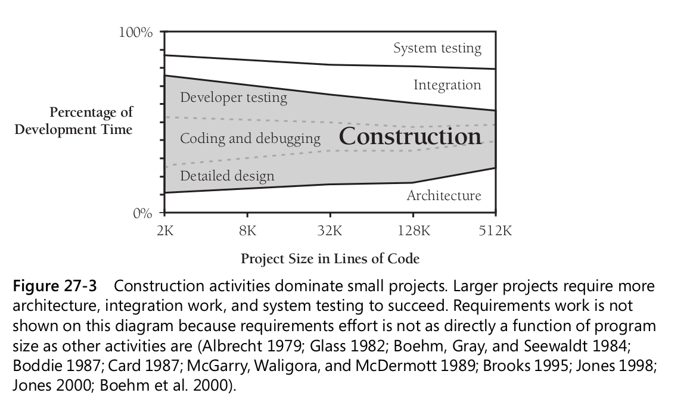
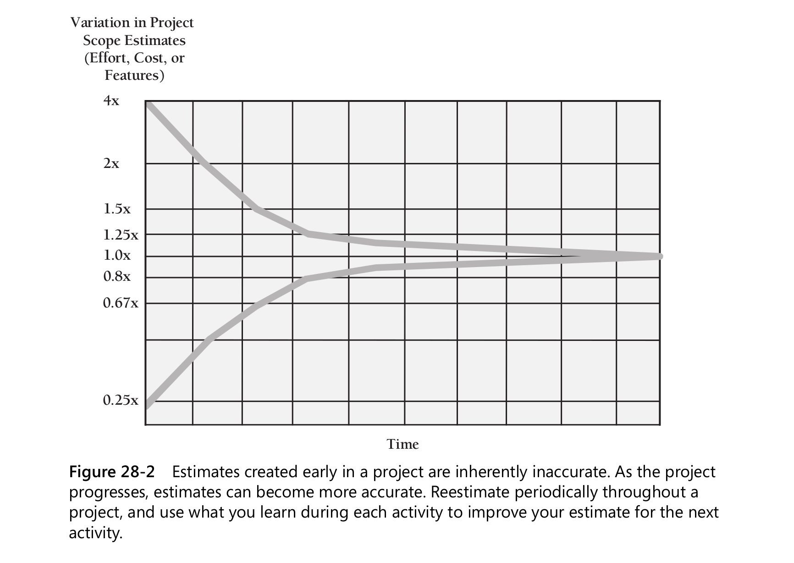
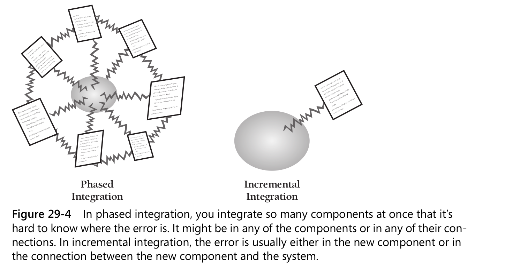
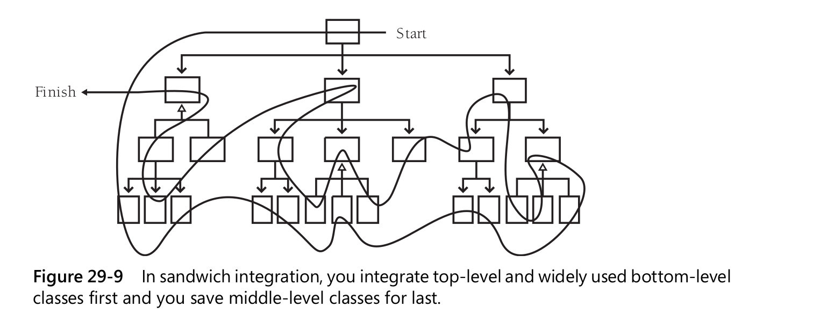
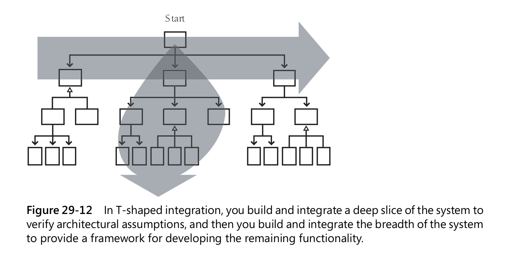

## How Program Size Affects Construction

### 27.3 Effect of Project Size on Errors

The number of errors increases dramatically as project size increases, with very large projects having up to
four times as many errors per thousand lines of code as small projects.

### 27.4 Effect of Project Size on Productivity

At small sizes (2000 lines of code or smaller), the single biggest influence on productivity is the skill of the
individual programmer (Jones 1998). As project size increases,
team size and organization become greater influences on productivity.

### 27.5 Effect of Project Size on Development Activities

Construction becomes less predominant because as project size increases, the construction activities—detailed design,
coding, debugging, and unit testing—scale up proportionately but many other activities scale up faster.

Here’s a list of activities that grow at a more-than-linear rate as project size increases:

- Communication
- Planning
- Management
- Requirements development
- System functional design
- Interface design and specification
- Architecture
- Integration
- Defect removal
- System testing
- Document production

## 28 Managing Construction

### 28.1 Encouraging Good Coding

Techniques for Encouraging Good Coding

- Review
- Assign two people to every part of the project
- Route good code examples for review
- Reward good code

### 28.2 Configuration Management

Configuration management is the practice of identifying project artifacts and handling
changes systematically so that a system can maintain its integrity over time. Another
name for it is “change control.”

### 28.3 Estimating a Construction Schedule

### 28.4 Measurement

Project better be measured. Set goals, start small.

- Total lines of code written
- Total number of defects
- Location of each defect (class or routine)
- Work hours spent correcting each defect
- Work-hours spent on the project
- Dollars spent per line of code
- Number of public routines on each class
- Lines of code in each class or routine
- ...

### 28.5 Treating Programmers as People

**Variation in Performance and Quality**

The original study that showed huge variations in individual programming productivity was conducted in the late 1960s by
Sackman, Erikson, and Grant (1968). They
studied professional programmers with an average of 7 years’ experience and found
that the ratio of initial coding time between the best and worst programmers was
about 20 to 1, the ratio of debugging times over 25 to 1, of program size 5 to 1, and of
program execution speed about 10 to 1

**Team Variation**  
Programming teams also exhibit sizable differences in software quality and productivity.
Good programmers tend to cluster, as do bad programmers

An earlier study of programming teams observed a 5-to-1 difference in program size
and a 2.6-to-1 variation in the time required for a team to complete the same project

____
If you have to pay more to get a top-10-
percent programmer rather than a bottom-10-percent programmer, jump at the chance.
You’ll get an immediate payoff in the quality and productivity of the programmer you
hire, and you’ll get a residual effect in the quality and productivity of the other programmers
your organization is able to retain because good programmers tend to cluster.
____

Physical Environment
The better environment the better you can code.

### 29.1 Importance of the Integration Approach

If you construct and integrate software in the wrong order, it’s harder to code, harder to test, and harder to debug. If
none of it will work until all of it works, it can seem as though it will never be finished.

Proper Integration Approach can help with

- better morale
- More reliable schedule estimates
- Improved code quality

### 29.2 Integration Frequency—Phased or Incremental?

Phased Integration
Until a few years ago, phased integration was the norm. It follows these well-defined steps, or phases:

1. Design, code, test, and debug each class. This step is called “unit development.”
2. Combine the classes into one whopping-big system (“system integration”).
3. Test and debug the whole system. This is called “system dis-integration.”
   (Thanks to Meilir Page-Jones for this witty observation.)

For small programs—no, for tiny programs—phased integration might be the best
approach. If the program has only two or three classes, phased integration might save
you time, if you’re lucky. But in most cases, another approach is better.

Benefits of Incremental Integration

- Errors are easy to locate
  
- The system succeeds early in the project
- You get improved progress monitoring
- You can build the system with a shorter development schedule (it allows some work to be done in parallel)
- You’ll improve customer relations

### 29.3 Incremental Integration Strategies

Integration-order strategies come in a variety of shapes and sizes, and none is best in
every case.

#### Top-Down Integration

In top-down integration, the class at the top of the hierarchy is written and integrated
first. Stubs have to be written to exercise the top class. Then, as classes are integrated from
the top down, stub classes are replaced with real ones.
All the classes at the top of the hierarchy are exercised a lot so that big,
conceptual, design problems are exposed quickly.
Another advantage of top-down integration is that, if you plan it carefully, you can
complete a partially working system early in the project.

Disadvantages:

- low-level problem to bubble its way to the top of the system, causing high-level changes and reducing the benefit of
  earlier integration work. Maybe at the end of the project.
- Another problem with pure top-down integration is that you need a dump truck full of
  stubs to integrate from the top down.

#### Bottom-Up Integration

If the system has conceptual design problems at the higher levels, construction won’t find them until all the detailed
work has been done. If the design must be changed significantly, some of the low-level work
might have to be discarded.

#### Sandwich Integration

**Risk-Oriented Integration (hard part first integration)**

like sandwich but choose most difficult part

**Feature-Oriented Integration**

**T-Shaped Integration**

Bottom-up, top-down, sandwich, risk-oriented, feature-oriented, T-shaped—do you get the
feeling that people are making these names up as they go along? They are. None of these
approaches are robust procedures that you should follow methodically from step 1 to
step 47 and then declare yourself to be done. Like software-design approaches, they are
heuristics more than algorithms, and rather than following any procedure dogmatically,
you come out ahead by making up a unique strategy tailored to your specific project.

### 29.4 Daily Build and Smoke Test

- Do daily builds with smoke test
- Automate the daily build and smoke test
- Release builds in the morning
- Build and smoke test even under pressure

Continuous Integration
“continuous” to mean “at least daily”

## 30 Programming Tools

A dog might be man’s best friend, but a few good tools are a programmer’s best
friends. As Barry Boehm discovered long ago, 20 percent of the tools tend to account
for 80 percent of the tool usage (1987b). If you’re missing one of the more helpful
tools, you’re missing something that you could use a lot.

### 30.2 Source-Code Tools

Integrated Development Environments (IDEs)

### 30.5 Building Your Own Programming Tools

Nearly all large organizations (organizations with more than 1000 programmers) have internal tool and support groups.

### 30.6 Tool Fantasyland

We will always need people who can bridge the gap between the real-world problem
to be solved and the computer that is supposed to be solving the problem. These people will be called programmers
regardless of whether we’re manipulating machine
registers in assembler or dialog boxes in Microsoft Visual Basic. As long as we have
computers, we’ll need people who tell the computers what to do, and that activity will
be called programming.