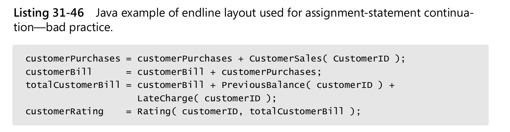

## 31 Layout and Style

In their classic paper “Perception in Chess,” Chase and Simon reported on a study
that compared the abilities of experts and novices to remember the positions of pieces
in chess (1973). When pieces were arranged on the board as they might be during
a game, the experts’ memories were far superior to the novices’. When the pieces
were arranged randomly, there was little difference between the memories of the
experts and the novices. The traditional interpretation of this result is that an
expert’s memory is not inherently better than a novice’s but that the expert has a
knowledge structure that helps him or her remember particular kinds of information. When new information corresponds to
the knowledge structure—in this case,
the sensible placement of chess pieces—the expert can remember it easily. When
new information doesn’t correspond to a knowledge structure—the chess pieces are
randomly positioned—the expert can’t remember it any better than the novice.  
A few years later, Ben Shneiderman duplicated Chase and Simon’s results in the computer-programming arena and reported
his results in a paper called “Exploratory Experiments in Programmer Behavior” (
1976). Shneiderman found that when program
statements were arranged in a sensible order, experts were able to remember them better than novices. When statements
were shuffled, the experts’ superiority was reduced.

So stability in layout and structure are important.
This experience, as well as the studies cited above, suggest that structure helps experts to perceive, comprehend, and
remember important features of programs.

- Use more parentheses than you think you need.



Looks attractive, but changes to many lines when code reformatted, and on CR way more lines changed then should be.

- Comments done well can greatly enhance a program’s readability; comments done poorly can actually hurt it.

## 32 Self-Documenting Code

In well-written code, comments are the icing on the readability cake.

A six-month study conducted by IBM
found that maintenance programmers “most often said that understanding the original
programmer’s intent was the most difficult problem” (Fjelstad and Hamlen 1979).

- Effective commenting isn’t that time-consuming.
- Use the Pseudocode Programming Process to reduce commenting time
- Integrate commenting into your development style

### 32.5 Commenting Techniques

- Avoid endline comments except data declarations and ends of blocks
- Focus paragraph comments on the why rather than the how
- Document surprises

```php
//C++ Example of Documenting a Surprise
for ( element = 0; element < elementCount; element++ ) {
// Use right shift to divide by two. Substituting the
// right-shift operation cuts the loop time by 75%.
elementList[ element ] = elementList[ element ] >> 1;
}
```

- Avoid abbreviations
- Don’t comment tricky code; rewrite it.  
  One study found that areas of source code with large numbers of comments also
  tended to have the most defects and to consume the most development effort.
  When someone says, “This is really tricky code,” I hear them say, “This is really bad code.”

#### Commenting Data Declarations

- Comment the units of numeric data  
  An expression like ```distanceToSurface = marsLanderAltitude``` looks like it’s probably correct,
  but ```distanceToSurfaceInMeters = marsLanderAltitudeInFeet``` exposes an obvious error.
- Comment the range of allowable numeric values  
  If a variable has an expected range of values, document the expected range.
- Comment limitations on input data
- Document global data and Document the routine’s global effects
- Document the source of algorithms that are used

Describe each routine in one or two sentences at the top of the routine If you can’t
describe the routine in a short sentence or two, you probably need to think harder
about what it’s supposed to do. Difficulty in creating a short description is a sign that
the design isn’t as good as it should be. Go back to the design drawing board and try
again.

#### The Book Paradigm for Program Documentation

They found that by thinking of code as a special kind of book and by formatting it
accordingly, they could achieve their goals. In the Book Paradigm, code and its documentation are organized into several
components similar to the components of a book
to help programmers get a high-level view of the program.

Key Points

- Done poorly, commenting is a waste of time and sometimes
  harmful. Done well, commenting is worthwhile.
- The source code should contain most of the critical information about the program. As long as the program is running,
  the source code is more likely than any
  other resource to be kept current, and it’s useful to have important information
  bundled with the code.
- Good code is its own best documentation. If the code is bad enough to require
  extensive comments, try first to improve the code so that it doesn’t need extensive comments.
- Comments should say things about the code that the code can’t say about
  itself - at the summary level or the intent level.
- Some commenting styles require a lot of tedious clerical work. Develop a style
  that’s easy to maintain.

## 33 Personal Character

- If you’re a software engineer, your basic building material is human intellect and your
  primary tool is you.
- The whole job of programming is building air castles

Once you decide to make yourself a superior programmer, the potential for improvement is huge. Study after study has
found differences on the order of 10 to 1 in the
time required to create a program. They have also found differences on the order of 10
to 1 in the time required to debug a program and 10 to 1 in the resulting size, speed,
error rate, and number of errors detected (Sackman, Erikson, and Grant 1968; Curtis
1981; Mills 1983; DeMarco and Lister 1985; Curtis et al. 1986; Card 1987; Valett and
McGarry 1989)

### 33.2 Intelligence and Humility

Edsger Dijkstra delivered a paper titled “The Humble Programmer.” He argued
that most of programming is an attempt to compensate for the strictly limited size of
our skulls. The people who are best at programming are the people who realize how
small their brains are. They are humble.

The purpose of many good programming practices is to reduce the load on your gray
cells.

### 33.3 Curiosity

- Build your awareness of the development process
- Experiment
- Read about problem solving
- Analyze and plan before you act
- Learn about successful projects
- Read
- Affiliate with other professionals

### 33.4 Intellectual Honesty

### 33.5 Communication and Cooperation

### 33.6 Creativity and Discipline

In a 15-year retrospective on work at NASA’s Software Engineering Laboratory,
McGarry and Pajerski reported that methods and tools that emphasize human discipline have been especially effective (
1990). Many highly creative people have been
extremely disciplined. “Form is liberating,” as the saying goes. Great architects work
within the constraints of physical materials, time, and cost. Great artists do, too.

### 33.9 Habits

Good habits matter because most of what you do as a programmer you do without
consciously thinking about it.
Bill Gates says that any programmer who will ever be good is good in the first few
years. After that, whether a programmer is good or not is cast in concrete (Lammers
1986). After you’ve been programming a long time, it’s hard to suddenly start saying,
“How do I make this loop faster?” or “How do I make this code more readable?” These
are habits that good programmers develop early.

- When you first learn something, learn it the right way.
- You can’t replace a bad habit with no habit at all. (test before code)
- The characteristics that matter most are humility, curiosity, intellectual honesty,
  creativity and discipline, and enlightened laziness.

## 34 Themes in Software Craftsmanship

### 34.1 Conquer Complexity

The motivation behind many programming practices is to reduce a program’s
complexity, and reducing complexity is arguably the most important key to being an
effective programmer.

### 34.2 Pick Your Process

On a small project, the talents of the individual programmer are the biggest influence on the quality of the software.
Part of what makes an individual programmer successful is his or her choice of processes.   
On projects with more than one programmer, organizational characteristics make a bigger difference than the skills of
the individuals involved do. Even if you have a great team, its collective ability isn’t simply the sum of the team
members’ individual abilities.  
The way in which people work together determines whether their abilities are added to
each other or subtracted from each other. The process the team uses determines
whether one person’s work supports the work of the rest of the team or undercuts it.

One example of the way in which process matters is the consequence of not making
requirements stable before you begin designing and coding. If you don’t know what
you’re building, you can’t very well create a superior design for it.
“Sure,” you say, “but in the real world, you never really have stable requirements, so
that’s a red herring.” Again, the process you use determines both how stable your
requirements are and how stable they need to be.

Observing large processes and small processes means pausing to pay attention to how
you create software.

### 34.6 Program in Terms of the Problem Domain

### 34.7 Watch for Falling Rocks

A good process wouldn’t allow error-prone code to be developed. It would include the
checks and balances of architecture followed by architecture reviews, design followed
by design reviews, and code followed by code reviews. By the time the code was ready
for testing, most errors would have been eliminated. Exceptional performance
requires working smart in addition to working hard. Lots of debugging on a project is
a warning sign that implies people aren’t working smart. Writing a lot of code in a day
and then spending two weeks debugging it is not working smart.

When you’re deep into a program, pay attention to warning signs that indicate that
part of the program design isn’t defined well enough to code. Difficulties in writing
comments, naming variables, and decomposing the problem into cohesive classes
with clear interfaces all indicate that you need to think harder about the design before
coding. Wishy-washy names and difficulty in describing sections of code in concise
comments are other signs of trouble. When the design is clear in your mind, the low level details come easily.

- Any discomfort is a clue.
- The quality of the thinking that goes into a program largely determines
  the quality of the program, so paying attention to warnings about the quality of thinking directly affects the final
  product.

### 34.8 Iterate, Repeatedly, Again and Again

- Projects fail because they commit themselves to a solution before exploring alternatives. Iteration provides a way to
  learn about a product before you build it.
- Both high-level and low-level design attempts should be repeated. A first
  attempt might produce a solution that works, but it’s unlikely to produce the best
  solution.
- One definition of engineering is to do for a dime what anyone can do for a dollar. Iterating in the late stages is
  doing for two dollars what anyone can do for one dollar.

### 34.9 Thou Shalt Rend Software and Religion Asunder

#### Eclecticism

- If you decide on the solution method before you fully understand the
  problem, you act prematurely.

You can use a box
wrench, vise-grip pliers, or a crescent wrench. In some cases, however, the tool selection matters a lot, so you should
always make your selection carefully. Engineering is
in part a discipline of making tradeoffs among competing techniques. You can’t make
a tradeoff if you’ve prematurely limited your choices to a single tool.  
The toolbox metaphor is useful because it makes the abstract idea of eclecticism concrete. Suppose you were a general
contractor and your buddy Simple Simon always
used vise-grip pliers. Suppose he refused to use a box wrench or a crescent wrench.
You’d probably think he was odd because he wouldn’t use all the tools at his disposal.
The same is true in software development. At a high level, you have alternative design
methods. At a more detailed level, you can choose one of several data types to represent any given design.  
A dogmatic stance conflicts with the eclectic toolbox approach to software construction. It’s incompatible with the
attitude needed to build high-quality software.