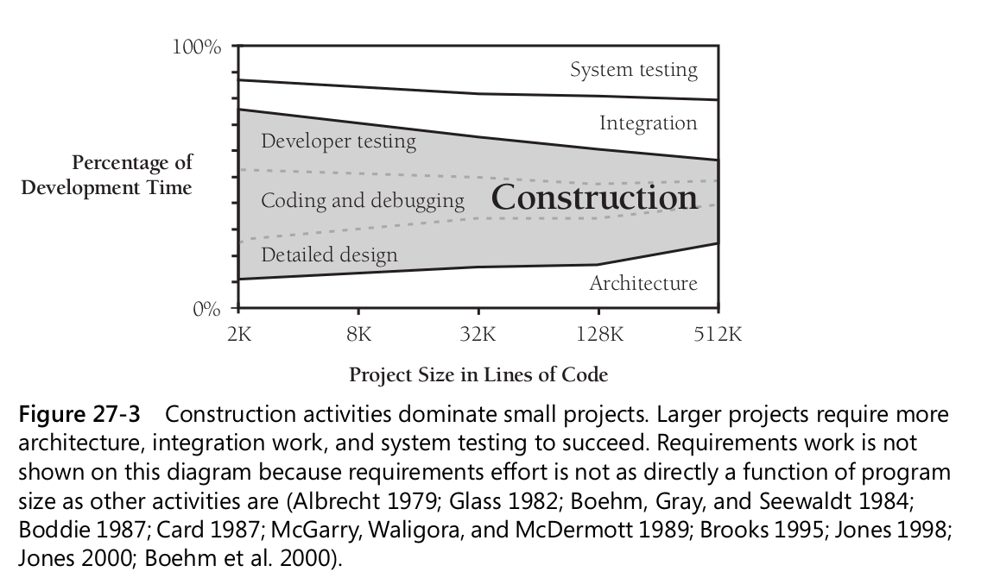

## How Program Size Affects Construction

### 27.3 Effect of Project Size on Errors

The number of errors increases dramatically as project size increases, with very large projects having up to
four times as many errors per thousand lines of code as small projects.

### 27.4 Effect of Project Size on Productivity

At small sizes (2000 lines of code or smaller), the single biggest influence on produc-
tivity is the skill of the individual programmer (Jones 1998). As project size increases,
team size and organization become greater influences on productivity.

### 27.5 Effect of Project Size on Development Activities

Construction becomes less predominant because as project size increases, the construc-
tion activities—detailed design, coding, debugging, and unit testing—scale up propor-
tionately but many other activities scale up faster.

Here’s a list of activities that grow at a more-than-linear rate as project size increases:

- Communication
- Planning
- Management
- Requirements development
- System functional design
- Interface design and specification
- Architecture
- Integration
- Defect removal
- System testing
- Document production

## 28 Managing Construction

