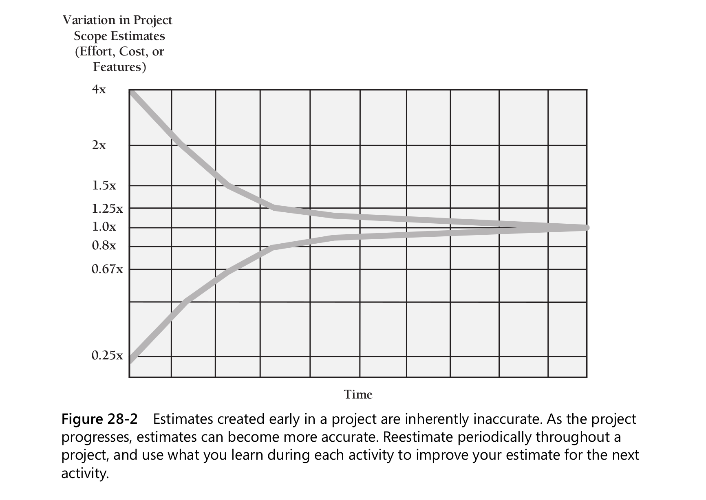

## How Program Size Affects Construction

### 27.3 Effect of Project Size on Errors

The number of errors increases dramatically as project size increases, with very large projects having up to
four times as many errors per thousand lines of code as small projects.

### 27.4 Effect of Project Size on Productivity

At small sizes (2000 lines of code or smaller), the single biggest influence on produc-
tivity is the skill of the individual programmer (Jones 1998). As project size increases,
team size and organization become greater influences on productivity.

### 27.5 Effect of Project Size on Development Activities

Construction becomes less predominant because as project size increases, the construc-
tion activities—detailed design, coding, debugging, and unit testing—scale up propor-
tionately but many other activities scale up faster.

Here’s a list of activities that grow at a more-than-linear rate as project size increases:

- Communication
- Planning
- Management
- Requirements development
- System functional design
- Interface design and specification
- Architecture
- Integration
- Defect removal
- System testing
- Document production

## 28 Managing Construction

### 28.1 Encouraging Good Coding

Techniques for Encouraging Good Coding

- Review
- Assign two people to every part of the project
- Route good code examples for review
- Reward good code

### 28.2 Configuration Management

Configuration management is the practice of identifying project artifacts and handling
changes systematically so that a system can maintain its integrity over time. Another
name for it is “change control.”

### 28.3 Estimating a Construction Schedule

### 28.4 Measurement

Project better be measured. Set goals, start small.

- Total lines of code written
- Total number of defects
- Location of each defect (class or routine)
- Work hours spent correcting each defect
- Work-hours spent on the project
- Dollars spent per line of code
- Number of public routines on each class
- Lines of code in each class or routine
- ...

### 28.5 Treating Programmers as People

**Variation in Performance and Quality**

The original study that showed huge variations in individual programming productiv-
ity was conducted in the late 1960s by Sackman, Erikson, and Grant (1968). They
studied professional programmers with an average of 7 years’ experience and found
that the ratio of initial coding time between the best and worst programmers was
about 20 to 1, the ratio of debugging times over 25 to 1, of program size 5 to 1, and of
program execution speed about 10 to 1

**Team Variation**  
Programming teams also exhibit sizable differences in software quality and productivity.
Good programmers tend to cluster, as do bad programmers

An earlier study of programming teams observed a 5-to-1 difference in program size
and a 2.6-to-1 variation in the time required for a team to complete the same project

____
If you have to pay more to get a top-10-
percent programmer rather than a bottom-10-percent programmer, jump at the chance.
You’ll get an immediate payoff in the quality and productivity of the programmer you
hire, and you’ll get a residual effect in the quality and productivity of the other programmers
your organization is able to retain because good programmers tend to cluster.
____

Physical Environment
The better environment the better you can code.
