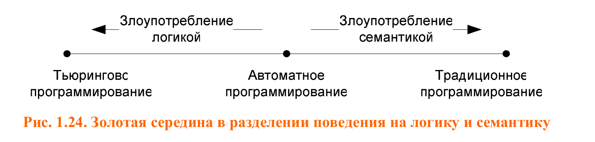

### 1.3. Парадигма автоматного программирования

Чтобы сделать программу простой и понятной,
необходимо явно выделить управляющие состояния (идентифицировать их, дать им
имена) и описать поведение сущности в каждом из них.

Например, при реализации электронных часов с будильником можно выделить три
управляющих состояния: «Будильник выключен», «Установка времени будильника»
и «Будильник включен». В каждом из этих состояний реакция будильника на
нажатие любой кнопки будет однозначной и специфической.

Вся логика поведения сущности сосредоточена в управляющем автомате.
Объект управления, в свою очередь, обладает простым
поведением (а следовательно, может быть легко реализован традиционными
«неавтоматными» методами). Он не обрабатывает непосредственно входные
воздействия от внешней среды, а только получает от автомата команды совершить те или иные действия.

### 1.4. Автоматные модели

