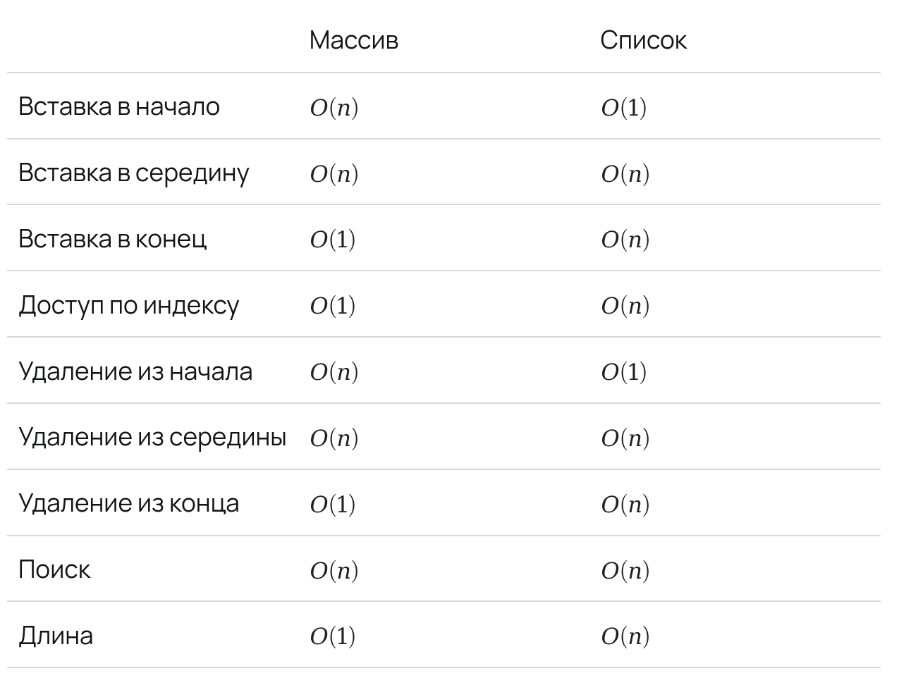

Структура данных — это способ хранения данных в памяти компьютера.

### Hashtable hashmap hash

1 значения хранятся в памяти
5 ->
Хеш функция - для чисел например можно использовать %
Бакет
поинтер

### Связный список linked list

Данные хранятся не как в массиве один за одним, а в разброс.
Если нужно много добавлять данных,
то обычный массив может оказаться медленным из-за его частого изменения размера и последующей перестройки в памяти.

Связный список решает эту проблему. Он хранит значение и ссылку на следующий элемент списка.

Время добавления узла в начало всегда одно и то же и не зависит от размера списка O(1).
Время добавления узла в середину O(n)

Применяется например для хранения коллизий в хешмап.

### Двусвязный список

Больше кода и накладных расходов,
но можно добавлять быстро данные как в начало так и в конец списка, а так же в середину

Смотрим таблицу
https://www.bigocheatsheet.com/