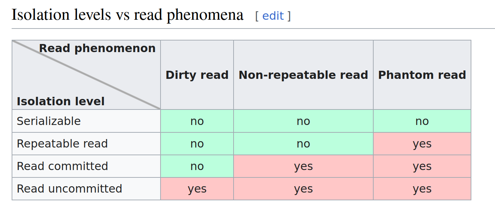

### Transaction

- Обеспечивают атомарность. Либо все выполняется, либо ничего.
- Транзакции, обеспечивают последовательное выполнение записей, даже если они поступили в БД одновременно.
  Первая транзакция накладывает лок на данные. Вторая ждет ее выполнения или отката и потом накладывает свой лок.
  Т.е. бд в рамках транзакции получила запрос на апдейт, второй запрос на апдейт этой же записи будет ждать завершения
  первого.
- Транзакции доступны с разными уровнями изоляции. Эти уровни определяют какие данные может видеть текущая транзакция по
  другим незавершенным транзакциям.

### ACID (Atomicity, Consistency, Isolation, Durability)

- Atomicity guarantees that each transaction is treated as a single "unit", which either succeeds completely or fails
  completely
- Consistency ensures that a transaction can only bring the database from one consistent state to another, preserving
  database invariants. Physical and logical consistency.
- Isolation ensures that concurrent execution of transactions leaves the database in the same state that would have been
  obtained if the transactions were executed sequentially.
- Durability guarantees that once a transaction has been committed, it will remain committed even in the case of a
  system failure (e.g., power outage or crash).

### Isolation level

- READ UNCOMMITTED - you can read uncommitted changes by another transaction (dirty read)
- READ COMMITTED - Isolation level that guarantees that any data read is committed at the moment it is read. It simply
  restricts the reader from seeing any intermediate, uncommitted, 'dirty' read.
- REPEATABLE READ - If the transaction re-issues the read, it will find the same data even data changes in another
  transactions.
  Whe use it? - Because REPEATABLE READ is the ideal isolation level for read-only transactions.
- SERIALIZABLE - range-locks are managed, so Phantom read can't occur. This level is like REPEATABLE READ, but InnoDB
  implicitly converts all plain SELECT statements to SELECT ... FOR SHARE if autocommit is disabled.
  More Deadlock may happen when you update rows with this isolation level.
  When you use a non-SERIALIZABLE isolation level, you're giving the database permission to return an incorrect answer
  in the hope that it will be faster than producing the correct one.
  A typical use case for when SERIALIZABLE is the best option would be a banking or financial payments system that processes transactions that transfer money between accounts.

https://www.cockroachlabs.com/blog/sql-isolation-levels-explained/

### Non-repeatable reads (read skew)

### Phantom reads

### Lock in mysql

Non-locking read is default. For **locking read** use FOR SHARE, FOR UPDATE
Can help with problems - Lost update and Write skew

#### SELECT ... FOR SHARE

Sets a shared mode lock on any rows that are read. Other sessions can read the rows, but cannot modify them until your
transaction commits.

- Other transactions can read locked rows
- Other transactions are blocked from updating those rows
- If any of these rows were changed by another transaction that has not yet committed, your query
  waits until that transaction ends and then uses the latest values.

Looks like it more suit for insert

#### SELECT ... FOR UPDATE

Behave as SELECT ... FOR SHARE plus more

- blocked from doing SELECT ... FOR SHARE (FOR UPDATE), or from reading the data in certain transaction isolation
  levels (SERIALIZABLE).

When do locking read be sure to use fields with index preferably unique, to not lock all scanning rows in table.
And do not use reading lock on rows without index.

### ETC...

- A transaction will timeout after 50 seconds see innodb_lock_wait_timeout
- transaction provide an illusion that it’s the only process running in the database.