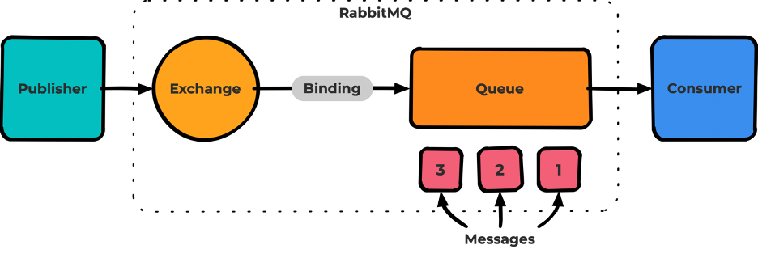

## Publisher

- Создаёт соединение (connection) по протоколу AMQP, в рамках соединения создаёт канал (channel).
- Publisher всегда пишет в exchange. По дефолту пишет в служебный exchange с routing key, совпадающим с названием
  очереди.
- Publisher определяет delivery_mode для каждого сообщения. delivery_mode=2 — хранить сообщения на диске.
- Publisher определяет Routing Key для каждого сообщения — признак, по которому идёт дальнейшая маршрутизация в Rabbit.
- Отправка сообщений в очередь \Modules\System\Application\Queue\AbstractQueue::publishMessage
  Routing Key в случае Exchange c типом Direct тот же что и имя очереди.
- На текущем проекте объявление очередей происходит в момент отправки сообщения.
  \Modules\System\Application\Queue\AbstractQueue::getStaticQueueByName
  Но консьюмеры тоже объявляют очередь - \Modules\System\Domain\Queue\Listen\FlowwowQueue::listen
- флаг mandatory — указание Rabbit складировать сообщения, не имеющие маршрута в какую-либо очередь в отдельный Exchange
  При mandatory false, если Exchange не сможет найти очередь, то сообщение будет потерянно.
- Либы которые используются на текущем проекте
  queue-interop/amqp-interop интерфейсы
  enqueue/amqp-lib (для консьюмеров) based on php-amqplib/php-amqplib (но также используется напрямую)

## Exchange

- Базовая сущность RabbitMQ. Является точкой входа и маршрутизатором/роутером всех сообщений
- Неизменяемая сущность: для изменения параметров Exchange нужно его удалять и декларировать заново.
- Binding: не являются частью Exchange, можно менять отдельно.
- Рассылает сообщение во все очереди с подходящими binding
- Durable/Transient — признак персистентности Exchange. Durable означает, что exchange сохранится после перезагрузки
  Rabbit.
- Exchange не подразумевает хранения!

Выделяют четыре типа Exchange:

- Fanout - Exchange публикует сообщения во все очереди, в которых есть binding, игнорируя любые настройки binding (
  routing key или заголовки).
- Direct - Exchange публикует сообщения во все очереди, в которых Routing Key binding полностью совпадает с Routing Key
  Messages
- Topic - тип Exchange, похожий на Direct, но поддерживающий в качестве параметров binding Wildcard * и #
- Headers - Наиболее гибкий, но наименее производительный тип.
  Оперирует не Routing key, а заголовками сообщений и binding. В binding указываются ожидаемые заголовки, а также
  признак x-match

- На текущем проекте по дефолту direct c именем (AMQP default) или "".
- Для реализации событийной модели используется fanout.
- When a queue is declared, RabbitMQ will automatically bind that queue to the default exchange using its (queue) name
  as the routing key

## Binding

- Базовая сущность Rabbit, статический маршрут от Exchange до Queue (от обменника до очереди).
- Неизменяемая сущность: если нужно изменить binding, его удаляют и декларируют заново.

## Queue

- Базовая сущность RabbitMQ, представляет из себя последовательное хранилище для необработанных сообщений.
- Хранение сообщений на диске (persistent) зависит от флага delivery_mode, назначаемым publisher для каждого сообщения.

Есть три типа очередей:

- Classic — обычная очередь, используется в большинстве случаев.
- Quorum — аналог классической очереди, но с обеспечением гарантий консистентности, достигаемый кворумом в кластере.
- Stream — новый вид очередей (начиная с версии Rabbimq 3.9) аналог принципов Apache Kafka.

### Quorum queue

- Quorum queue for clustering.
- Messages are replicated to n/2+1 nodes. Less chance to lost messages than with the classic queue.
- More work, slower. In same cases streams is the answer.

На текущем проекте все очереди кворумные.
Отложенные сообщения кидаются в обменник delayed.fw.exchange и его очереди (классические). У этих очередей нет
консьюмеров.
Далее после того как ttl сообщения истекает, то сообщения перенаправляются в обменник fw.exchange у которого есть
очереди с консьюмерами.
new AMQPTable(['x-dead-letter-exchange' => 'fw.exchange'])

## Message

Базовая сущность RabbitMQ — само сообщение, несёт полезную нагрузку (payload), проходит весь путь от Publisher до
Consumer.

Важные поля:

- payload — полезная нагрузка, может быть как string, так и base64. Можно закидывать туда хоть картинки.
- routing key — ключ маршрутизации. Имя очереди.
- delivery_mode — признак персистентности;
- headers — заголовки сообщения. Нужны для работы Exchange типа headers, а также для дополнительных возможностей Rabbit
  типа TTL.

## Consumers

На текущем проекте

- Прослушивание сообщений из очереди происходит через класс
  \Modules\System\Domain\Queue\Listen\FlowwowQueueWithAsyncHeartbeat
- Перед обработкой сообщения ставится пометка ack.
  Таким образом в случае ошибки сообщение не отправится в очередь повторно.
- В случае ошибки при обработке сообщения, оно пишется в таблицу в БД
  Если конечно сам обработчик сообщения вдруг не перехватает и не замьютит исключение.
- Prefetch count на одном проекте стоит 1, на другом 10. \Enqueue\AmqpLib\AmqpContext в конструктор передается.
  Consumer Prefetch - max messages that can be passed to worker/chanel(if many queues for one worker) that is unacked.
- Кол-во воркеров/консьюмеров регулируется через конфиги Кубернетиса.

  ```
  autoscalingDaemons:
  enabled: true
  minReplicas: 1
  maxReplicas: 10
  mode: "QueueLength" # QueueLength or MessageRate
  target: 20
  ```

- Так же, как и Publisher, Consumer создаёт соединение (connection) по протоколу AMQP.
  В рамках соединения создаёт канал (channel) и уже инициирует consuming в рамках этого канала.

## Connection/Channel

- Connection: A TCP connection between your application and the broker.
- Channel: A virtual connection inside a connection. When publishing or consuming messages from a queue - it's all done
  over a channel.

## На бэкэнде

### Воркеры

- десериализуют сообщения из очереди и приводят к DTO оговоренной структуры
- определяют какой класс (джоба будет обрабатывать это dto)

### Джобы

Джоба - класс, в который приходит сообщение из очереди и там происходит запуск необходимых действий/логик.
