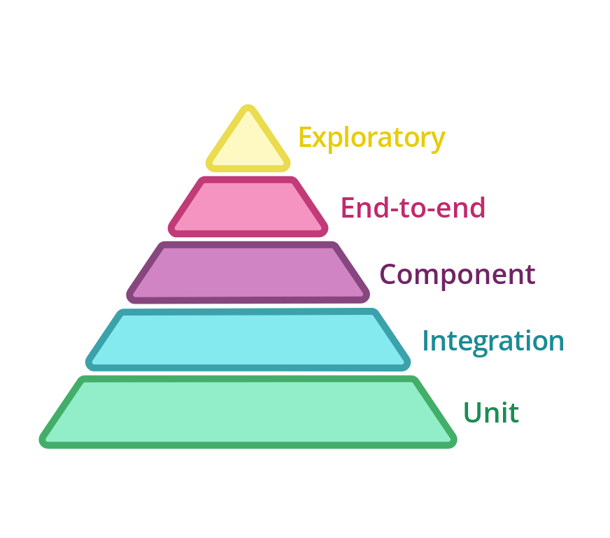
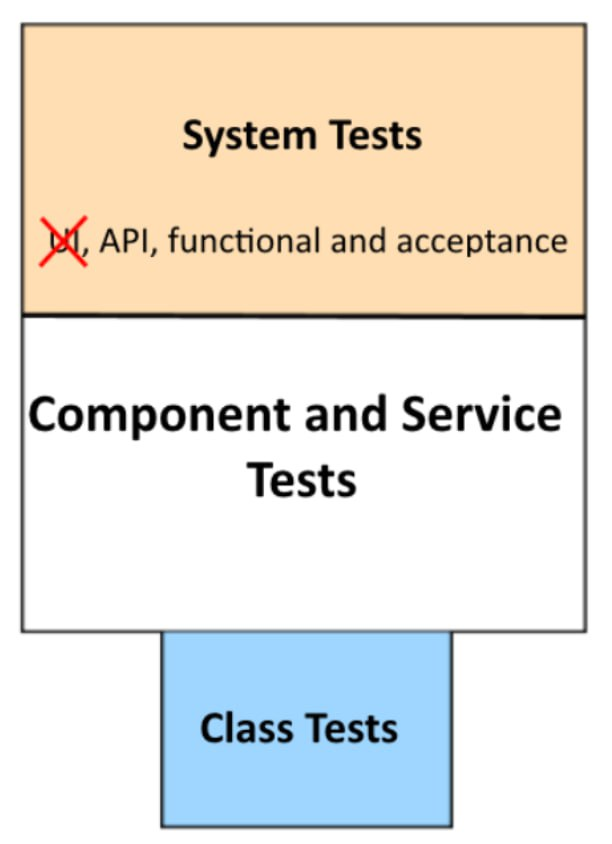
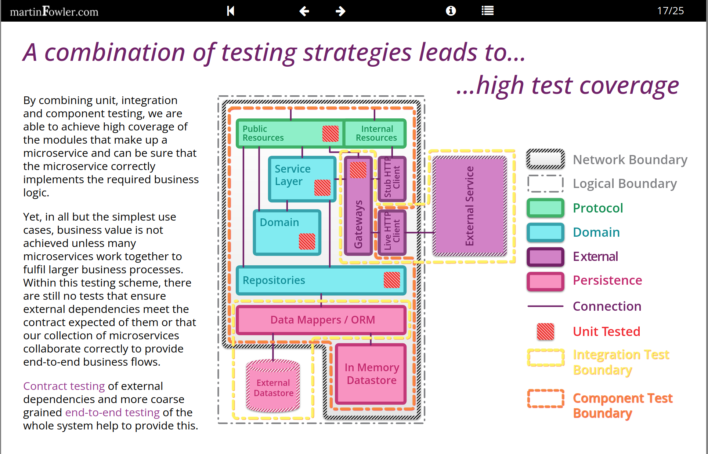
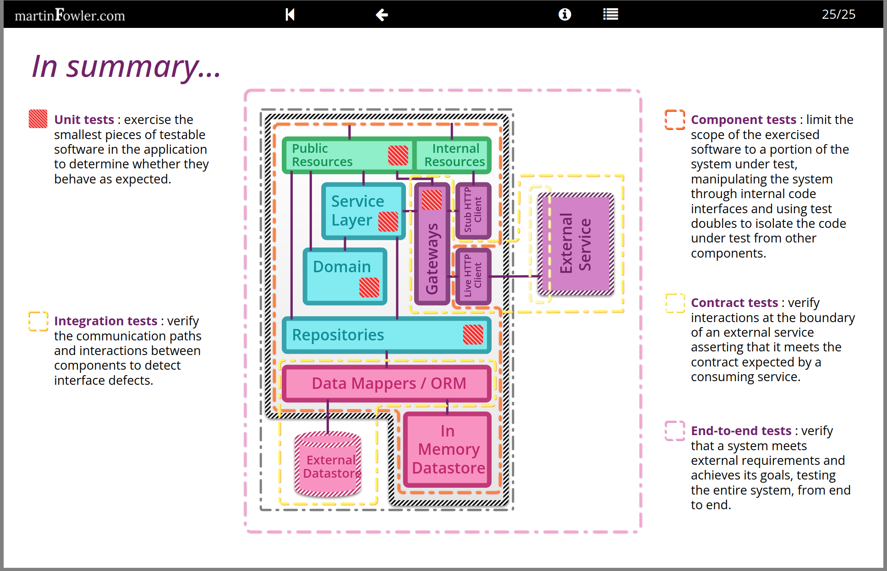

## Test types

### Matias Noback divide test in his book (advanced web application architecture)

- unit (isolated, test small part like an entity or value object)
- integration (test for adapters incoming and outgoing)
    - Contract tests for outgoing port adapters (DB, external DataProviders)
    - Driving tests for incoming port adapters (Controllers, API, CLI)
- use-case (isolated like a unit for domain logic (application services))
- end-to-end (test from start to end; as black box)

### Codeception test framework divide test on

- Acceptance (automated test with browser emulation like PhpBrowser)
- Functional (the test runner exercises the application's front controller programmatically, instead of through a web
  server)
- Unit

### stackoverflow (unit vs functional) (V-model)

**Test level** is easy to explain using V-model


**test types**

Test types emphasize your quality aspects, also known as technical or non-functional aspects.
Test types can be executed at any test level.
I like to use as test types the quality characteristics mentioned in ISO/IEC 25010:2011.

- functional testing
- reliability testing
- performance testing
- operability testing
- security testing
- compatibility testing
- maintainability testing
- transferability testing

### stackoverflow answer 3

One of test groups.
There are two big groups: Functional and Non-Functional Testing.


## Given/When/Then syntax:

- Given some initial context (the givens),
- When an event occurs,
- Then ensure some outcomes.


- Given the user with ID 1 has username "alice"
- When getting the username of the user with ID 1
- Then the username is "alice"

1. Givens should be in the past tense
2. Whens should be in the present tense
3. Thens should be in the future tense (often using "should" or "will")

```php
// Given the system has been configured to reroute all SMS messages to the email address developers@org.nl
$config = Mockery::mock(Config::class);
$config->shouldReceive('get')
    ->with('reroute_sms_to_email')
    ->andReturn('developers@org.nl');

// When the system sends an SMS
$fallbackMailer = Mockery::spy(Mailer::class);
$smsSender = new SmsSender($config, $fallbackMailer);
$smsSender->send('0612345678', 'The message');

// Then the SMS message will be sent as an email to developers@org.nl instead
$fallbackMailer->shouldHaveReceived('send')
    ->with(function (Mail $mail) {
        self::assertEquals('The message', $mail->plainTextBody());
        self::assertEquals('SMS for 0612345678', $mail->subject());

        return true;
    });

```

## M. Noback on tests

- We should consider test methods to be documentation or more specific: specification.
- "Don't Mock What you Don't Own" (Wrap the third party library, create interface and default realization with fake/test
  realization

#### Drawbacks of functional tests

- Faking a Request object
- Since you have access to the application's service container you may be tempted to open the black box and replace all
  kinds of services, or otherwise influence them. I recommend doing no such thing.
- You are likely to end up testing all kinds of domain-related behaviors through thick layers. This obscures the view on
  the real issues and makes it hard to figure out what's wrong, if anything pops up.
- "I see in database". This too is like opening the box and looking inside.  
  I'd like to follow this reasoning instead: if, as a user of the system, I expect a request to produce some kind of
  effect, then I should be able to notice this effect as a user. And as a user I can't look directly inside the
  database. There must be some other aspect of the system that was changed when I made that request. E.g. after
  registration I can now log in, or the product I added to my basket actually shows up on the "my shopping basket"
  page.  
  But always look for ways to prevent this, and let your application remain the black box that you poke at with HTTP
  requests only, making only assertions about the response you receive.

## one of test pyramids

classic one


reverse or trophy


## BDD

Each feature of a product should be born from a talk between

- business (analysts, product owner)
- developers
- QAs

which are known in BDD as “three amigos”.

Such talks should produce written stories. There should be an actor that doing some things, the feature that should be
fulfilled within the story and the result achieved.

## M. Fawler on test

https://martinfowler.com/articles/microservice-testing/#testing-progress-3

By combining

- unit,
- integration
- and component testing (deep logic test)

we are able to achieve high coverage of the modules that make up a
microservice and can be sure that the microservice correctly implements the required business logic.



testing summary



Google TotT
https://testing.googleblog.com/2024/10/smurf-beyond-test-pyramid.html

each test group has +/-
Exm. unit tests is fast and reliable.
- Speed (unit) can be run more often
- Maintainability (unit) The aggregated cost of debugging and maintaining tests
- Utilization (unit, integration)  Tests that use fewer resources (memory, disk, CPU) cost less to run.
- Reliability (unit, integration) Reliable tests only fail when an actual problem has been discovered.
- Fidelity (E2E, integration) closer to approximating real operating conditions
